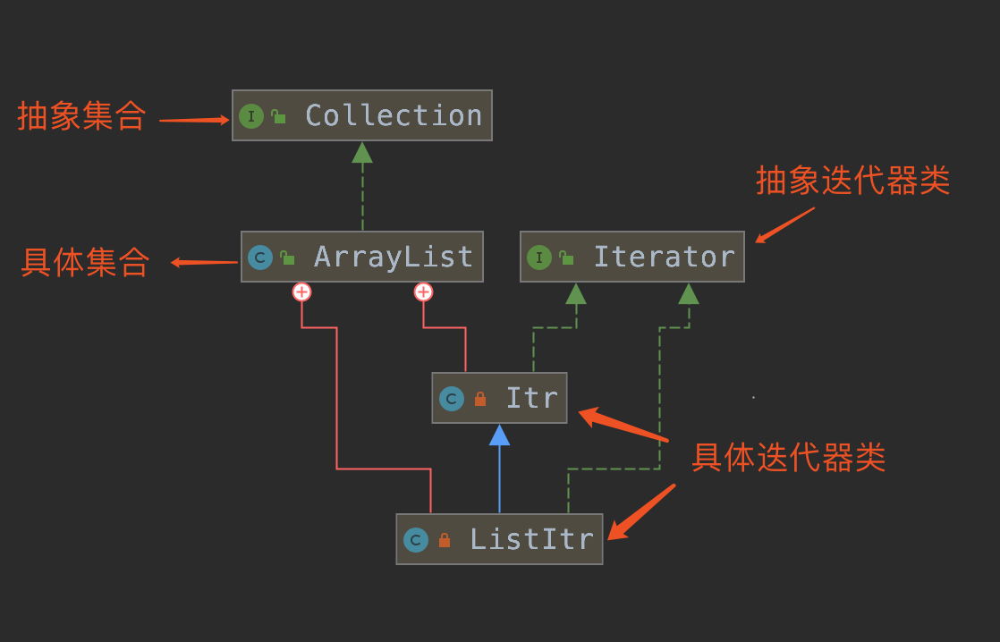

<!-- more -->

> [Snailclimb](https://github.com/Snailclimb)/[JavaGuide](https://github.com/Snailclimb/JavaGuide)
>
> [CyC2018](https://github.com/CyC2018)/[CS-Notes](https://github.com/CyC2018/CS-Notes)
>
> [《Java 面试进阶指南》](https://xiaozhuanlan.com/javainterview?rel=javaguide) 

## 编程思想

### OPP

面向过程编程（英语：Procedure-oriented Programming，缩写：OPP）

### OOP

面向对象编程（英语：Object-oriented programming，缩写：OOP）

#### OPP vs OOP

面向过程的程序设计<span style="color: red">把</span>计算机程序<span style="color: red">视为</span>一系列的**命令集合**，即一组函数的顺序执行。为了简化程序设计，面向过程把函数继续切分为子函数，即把大块函数通过切割成小块函数来降低系统的复杂度。

而面向对象的程序设计<span style="color: red">把</span>计算机程序<span style="color: red">视为</span>一组**对象的集合**，而每个对象都可以接收其他对象发过来的消息，并处理这些消息，**计算机程序的执行就是一系列消息在各个对象之间传递**。

#### 三大特征

面向对象的三大特征：封装、继承、多态

##### 封装

把数据以及对数据的操作封装在一个类里。

##### 继承

##### 多态

父类引用指向子类对象。

### AOP

在软件业，AOP 为 Aspect Oriented Programming 的缩写，意为：面向切面编程

## 数据结构

### 布隆过滤器

布隆过滤器是一种用来检索元素是否在给定大集合中的数据结构，这种数据结构是高效且性能很好的，但缺点是具有一定的错误识别率和删除难度。并且，理论情况下，添加到集合中的元素越多，误报的可能性就越大。

布隆过滤器（Bloom Filter）由二进制向量（或者说位数组）和一系列随机映射函数（哈希函数）两部分组成的数据结构。

#### 插入操作

1. 使用哈希函数对元素值进行计算，得到哈希值（有几个哈希函数得到几个哈希值）。
2. 根据得到的哈希值，在位数组中把对应下标的值置为 1。

#### 判断一个元素是否存在

1. 对给定元素再次进行相同的哈希计算；
2. 得到值之后判断位数组中的每个元素是否都为 1，如果值都为 1，那么说明这个值在布隆过滤器中，如果存在一个值不为 1，说明该元素不在布隆过滤器中。

布隆过滤器说某个元素存在，小概率会误判。布隆过滤器说某个元素不在，那么这个元素一定不在。

#### 使用场景

1. 判断给定数据是否存在：比如判断一个数字是否存在于包含大量数字的数字集中（数字集很大，5亿以上！）、 防止缓存穿透（判断请求的数据是否有效避免直接绕过缓存请求数据库）等等、邮箱的垃圾邮件过滤、黑名单功能等等。
2. 去重：比如爬给定网址的时候对已经爬取过的 URL 去重。

#### 实现

##### Google Guava 的布隆过滤器

创建了一个最多存放 最多 1500个整数的布隆过滤器，并且我们可以容忍误判的概率为百分之一（0.01）

```java
// 创建布隆过滤器对象
BloomFilter<Integer> filter = BloomFilter.create(
  Funnels.integerFunnel(),
  1500,
  0.01);
// 判断指定元素是否存在
System.out.println(filter.mightContain(1));
System.out.println(filter.mightContain(2));
// 将元素添加进布隆过滤器
filter.put(1);
filter.put(2);
System.out.println(filter.mightContain(1));
System.out.println(filter.mightContain(2));
```

##### Redis 中的布隆过滤器

Guava 提供的布隆过滤器的实现只能单机使用（另外，容量扩展也不容易），而现在互联网一般都是分布式的场景。为了解决这个问题，就需要用到 Redis 中的布隆过滤器了。

Redis v4.0 之后有了 Module（模块/插件） 功能，Redis Modules 让 Redis 可以使用外部模块扩展其功能 。

官网推荐了一个 RedisBloom 作为 Redis 布隆过滤器的 Module。

###### 常用命令

1. **`BF.ADD `**：将元素添加到布隆过滤器中，如果该过滤器尚不存在，则创建该过滤器。格式：`BF.ADD {key} {item}`。
2. **`BF.MADD `**: 将一个或多个元素添加到“布隆过滤器”中，并创建一个尚不存在的过滤器。该命令的操作方式`BF.ADD`与之相同，只不过它允许多个输入并返回多个值。格式：`BF.MADD {key} {item} [item ...]` 。
3. **`BF.EXISTS` ** : 确定元素是否在布隆过滤器中存在。格式：`BF.EXISTS {key} {item}`。
4. **`BF.MEXISTS`** ： 确定一个或者多个元素是否在布隆过滤器中存在格式：`BF.MEXISTS {key} {item} [item ...]`。

###### 使用

```bash
127.0.0.1:6379> BF.ADD myFilter java
(integer) 1
127.0.0.1:6379> BF.ADD myFilter javaguide
(integer) 1
127.0.0.1:6379> BF.EXISTS myFilter java
(integer) 1
127.0.0.1:6379> BF.EXISTS myFilter javaguide
(integer) 1
127.0.0.1:6379> BF.EXISTS myFilter github
(integer) 0
```

### B 树

B树（balance tree）可以认为是 m 叉的多路平衡查找树


### B+ 树

#### B树和B+树的区别

> [b树和b+树的区别](https://blog.csdn.net/login_sonata/article/details/75268075)

- B+树的中间节点不保存数据，只在叶子结点中保存数据；而B树数据分布在整颗树中。
- 因为B+树的叶子结点按顺序链接，可以很方便的进行**范围查找**。

### 红黑树

## 算法

### KMP 算法

谈到字符串问题，不得不提的就是 KMP 算法，它是用来解决字符串查找的问题，可以在一个字符串（S）中查找一个子串（W）出现的位置。KMP 算法把字符匹配的时间复杂度缩小到 O(m+n) ,而空间复杂度也只有O(m)。因为“暴力搜索”的方法会反复回溯主串，导致效率低下，而KMP算法可以利用已经部分匹配这个有效信息，保持主串上的指针不回溯，通过修改子串的指针，让模式串尽量地移动到有效的位置。

### 排序算法

排序算法的成本模型是比较和交换的次数。

#### 选择排序

从数组中选择最小元素，将它与数组的第一个元素交换位置。再从数组剩下的元素中选择出最小的元素，将它与数组的第二个元素交换位置。不断进行这样的操作，直到将整个数组排序。

选择排序需要 ~N2/2 次比较和 ~N 次交换，它的运行时间与输入无关，这个特点使得它对一个已经排序的数组也需要这么多的比较和交换操作。

[](https://camo.githubusercontent.com/7d5779d6bf5f57e00e5e48e49437a74a4d7e3cf7/68747470733a2f2f63732d6e6f7465732d313235363130393739362e636f732e61702d6775616e677a686f752e6d7971636c6f75642e636f6d2f62633662653264302d656435652d346465662d383965352d3361646139616661383131612e676966)


```java
public class Selection<T extends Comparable<T>> extends Sort<T> {

  @Override
  public void sort(T[] nums) {
    int N = nums.length;
    for (int i = 0; i < N - 1; i++) {
      int min = i;
      for (int j = i + 1; j < N; j++) {
        if (less(nums[j], nums[min])) {
          min = j;
        }
      }
      swap(nums, i, min);
    }
  }
}
```

#### 冒泡排序

从左到右不断交换相邻逆序的元素，在一轮的循环之后，可以让未排序的最大元素上浮到右侧。

在一轮循环中，如果没有发生交换，那么说明数组已经是有序的，此时可以直接退出。

[](https://camo.githubusercontent.com/c121fd9d4776aa05f1577a863250cacce1f9fb93/68747470733a2f2f63732d6e6f7465732d313235363130393739362e636f732e61702d6775616e677a686f752e6d7971636c6f75642e636f6d2f30663864313738622d353264382d343931622d396466642d3431653035613935323537382e676966)


```java
public class Bubble<T extends Comparable<T>> extends Sort<T> {

  @Override
  public void sort(T[] nums) {
    int N = nums.length;
    boolean isSorted = false;
    for (int i = N - 1; i > 0 && !isSorted; i--) {
      isSorted = true;
      for (int j = 0; j < i; j++) {
        if (less(nums[j + 1], nums[j])) {
          isSorted = false;
          swap(nums, j, j + 1);
        }
      }
    }
  }
}
```

#### 插入排序

每次都将当前元素插入到左侧已经排序的数组中，使得插入之后左侧数组依然有序。

对于数组 {3, 5, 2, 4, 1}，它具有以下逆序：(3, 2), (3, 1), (5, 2), (5, 4), (5, 1), (2, 1), (4, 1)，插入排序每次只能交换相邻元素，令逆序数量减少 1，因此插入排序需要交换的次数为逆序数量。

插入排序的时间复杂度取决于数组的初始顺序，如果数组已经部分有序了，那么逆序较少，需要的交换次数也就较少，时间复杂度较低。

- 平均情况下插入排序需要 ~N2/4 比较以及 ~N2/4 次交换；
- 最坏的情况下需要 ~N2/2 比较以及 ~N2/2 次交换，最坏的情况是数组是倒序的；
- 最好的情况下需要 N-1 次比较和 0 次交换，最好的情况就是数组已经有序了。

[](https://camo.githubusercontent.com/3e2e38e4ded17c7d4cd6945710d1d51d26118268/68747470733a2f2f63732d6e6f7465732d313235363130393739362e636f732e61702d6775616e677a686f752e6d7971636c6f75642e636f6d2f33353235336661342d663630612d346533622d616165632d3866633833356161626461632e676966)


```java
public class Insertion<T extends Comparable<T>> extends Sort<T> {

  @Override
  public void sort(T[] nums) {
    int N = nums.length;
    for (int i = 1; i < N; i++) {
      for (int j = i; j > 0 && less(nums[j], nums[j - 1]); j--) {
        swap(nums, j, j - 1);
      }
    }
  }
}
```

#### 希尔排序

对于大规模的数组，插入排序很慢，因为它只能交换相邻的元素，每次只能将逆序数量减少 1。希尔排序的出现就是为了解决插入排序的这种局限性，它通过交换不相邻的元素，每次可以将逆序数量减少大于 1。

希尔排序使用插入排序对间隔 h 的序列进行排序。通过不断减小 h，最后令 h=1，就可以使得整个数组是有序的。

[](https://camo.githubusercontent.com/1ca2add89effbf569df135b2ae0c1057a5de1049/68747470733a2f2f63732d6e6f7465732d313235363130393739362e636f732e61702d6775616e677a686f752e6d7971636c6f75642e636f6d2f37383138633537342d393761382d343864622d386536322d3862666230333062303262612e706e67)


```java
public class Shell<T extends Comparable<T>> extends Sort<T> {

  @Override
  public void sort(T[] nums) {

    int N = nums.length;
    int h = 1;

    while (h < N / 3) {
      h = 3 * h + 1; // 1, 4, 13, 40, ...
    }

    while (h >= 1) {
      for (int i = h; i < N; i++) {
        for (int j = i; j >= h && less(nums[j], nums[j - h]); j -= h) {
          swap(nums, j, j - h);
        }
      }
      h = h / 3;
    }
  }
}
```

希尔排序的运行时间达不到平方级别，使用递增序列 1, 4, 13, 40, ... 的希尔排序所需要的比较次数不会超过 N 的若干倍乘于递增序列的长度。后面介绍的高级排序算法只会比希尔排序快两倍左右。

#### 归并排序

归并排序的思想是将数组分成两部分，分别进行排序，然后归并起来。

[](https://camo.githubusercontent.com/ad8dbcf111d93c5fe575e1ce147599aefcabdd36/68747470733a2f2f63732d6e6f7465732d313235363130393739362e636f732e61702d6775616e677a686f752e6d7971636c6f75642e636f6d2f65633834303936372d643132372d346461332d623662622d3138363939366335363734362e706e67)


##### 1. 归并方法

归并方法将数组中两个已经排序的部分归并成一个。

```java
public abstract class MergeSort<T extends Comparable<T>> extends Sort<T> {

  protected T[] aux;


  protected void merge(T[] nums, int l, int m, int h) {

    int i = l, j = m + 1;

    for (int k = l; k <= h; k++) {
      aux[k] = nums[k]; // 将数据复制到辅助数组
    }

    for (int k = l; k <= h; k++) {
      if (i > m) {
        nums[k] = aux[j++];

      } else if (j > h) {
        nums[k] = aux[i++];

      } else if (aux[i].compareTo(aux[j]) <= 0) {
        nums[k] = aux[i++]; // 先进行这一步，保证稳定性

      } else {
        nums[k] = aux[j++];
      }
    }
  }
}
```

##### 2. 自顶向下归并排序

将一个大数组分成两个小数组去求解。

因为每次都将问题对半分成两个子问题，这种对半分的算法复杂度一般为 O(NlogN)。

```java
public class Up2DownMergeSort<T extends Comparable<T>> extends MergeSort<T> {

  @Override
  public void sort(T[] nums) {
    aux = (T[]) new Comparable[nums.length];
    sort(nums, 0, nums.length - 1);
  }

  private void sort(T[] nums, int l, int h) {
    if (h <= l) {
      return;
    }
    int mid = l + (h - l) / 2;
    sort(nums, l, mid);
    sort(nums, mid + 1, h);
    merge(nums, l, mid, h);
  }
}
```

##### 3. 自底向上归并排序

先归并那些微型数组，然后成对归并得到的微型数组。

```java
public class Down2UpMergeSort<T extends Comparable<T>> extends MergeSort<T> {

  @Override
  public void sort(T[] nums) {

    int N = nums.length;
    aux = (T[]) new Comparable[N];

    for (int sz = 1; sz < N; sz += sz) {
      for (int lo = 0; lo < N - sz; lo += sz + sz) {
        merge(nums, lo, lo + sz - 1, Math.min(lo + sz + sz - 1, N - 1));
      }
    }
  }
}
```

#### 快速排序

##### 1. 基本算法

- 归并排序将数组分为两个子数组分别排序，并将有序的子数组归并使得整个数组排序；
- 快速排序通过一个切分元素将数组分为两个子数组，左子数组小于等于切分元素，右子数组大于等于切分元素，将这两个子数组排序也就将整个数组排序了。

[](https://camo.githubusercontent.com/eda7de5fb7b862056b35daa26b290481a66f4475/68747470733a2f2f63732d6e6f7465732d313235363130393739362e636f732e61702d6775616e677a686f752e6d7971636c6f75642e636f6d2f36323334656233642d636366322d343938372d613732342d3233356165663639353762312e706e67)


```java
public class QuickSort<T extends Comparable<T>> extends Sort<T> {

  @Override
  public void sort(T[] nums) {
    shuffle(nums);
    sort(nums, 0, nums.length - 1);
  }

  private void sort(T[] nums, int l, int h) {
    if (h <= l)
      return;
    int j = partition(nums, l, h);
    sort(nums, l, j - 1);
    sort(nums, j + 1, h);
  }

  private void shuffle(T[] nums) {
    List<Comparable> list = Arrays.asList(nums);
    Collections.shuffle(list);
    list.toArray(nums);
  }
}
```

##### 2. 切分

取 a[l] 作为切分元素，然后从数组的左端向右扫描直到找到第一个大于等于它的元素，再从数组的右端向左扫描找到第一个小于它的元素，交换这两个元素。不断进行这个过程，就可以保证左指针 i 的左侧元素都不大于切分元素，右指针 j 的右侧元素都不小于切分元素。当两个指针相遇时，将切分元素 a[l] 和 a[j] 交换位置。

[](https://camo.githubusercontent.com/ffc612e3e9f579a35c1bf2a68b368055cd5eabfc/68747470733a2f2f63732d6e6f7465732d313235363130393739362e636f732e61702d6775616e677a686f752e6d7971636c6f75642e636f6d2f63343835393239302d653237642d346631322d626563662d6532613563316633613237352e676966)


```java
private int partition(T[] nums, int l, int h) {
  int i = l, j = h + 1;
  T v = nums[l];
  while (true) {
    while (less(nums[++i], v) && i != h) ;
    while (less(v, nums[--j]) && j != l) ;
    if (i >= j)
      break;
    swap(nums, i, j);
  }
  swap(nums, l, j);
  return j;
}
```

##### 3. 性能分析

快速排序是原地排序，不需要辅助数组，但是递归调用需要辅助栈。

快速排序最好的情况下是每次都正好将数组对半分，这样递归调用次数才是最少的。这种情况下比较次数为 CN=2CN/2+N，复杂度为 O(NlogN)。

最坏的情况下，第一次从最小的元素切分，第二次从第二小的元素切分，如此这般。因此最坏的情况下需要比较 N2/2。为了防止数组最开始就是有序的，在进行快速排序时需要随机打乱数组。

##### 4. 算法改进

###### 4.1 切换到插入排序

因为快速排序在小数组中也会递归调用自己，对于小数组，插入排序比快速排序的性能更好，因此在小数组中可以切换到插入排序。

###### 4.2 三数取中

最好的情况下是每次都能取数组的中位数作为切分元素，但是计算中位数的代价很高。一种折中方法是取 3 个元素，并将大小居中的元素作为切分元素。

###### 4.3 三向切分

对于有大量重复元素的数组，可以将数组切分为三部分，分别对应小于、等于和大于切分元素。

三向切分快速排序对于有大量重复元素的随机数组可以在线性时间内完成排序。

```java
public class ThreeWayQuickSort<T extends Comparable<T>> extends QuickSort<T> {

  @Override
  protected void sort(T[] nums, int l, int h) {
    if (h <= l) {
      return;
    }
    int lt = l, i = l + 1, gt = h;
    T v = nums[l];
    while (i <= gt) {
      int cmp = nums[i].compareTo(v);
      if (cmp < 0) {
        swap(nums, lt++, i++);
      } else if (cmp > 0) {
        swap(nums, i, gt--);
      } else {
        i++;
      }
    }
    sort(nums, l, lt - 1);
    sort(nums, gt + 1, h);
  }
}
```

##### 5. 基于切分的快速选择算法

快速排序的 partition() 方法，会返回一个整数 j 使得 a[l..j-1] 小于等于 a[j]，且 a[j+1..h] 大于等于 a[j]，此时 a[j] 就是数组的第 j 大元素。

可以利用这个特性找出数组的第 k 个元素。

该算法是线性级别的，假设每次能将数组二分，那么比较的总次数为 (N+N/2+N/4+..)，直到找到第 k 个元素，这个和显然小于 2N。

```java
public T select(T[] nums, int k) {
  int l = 0, h = nums.length - 1;
  while (h > l) {
    int j = partition(nums, l, h);

    if (j == k) {
      return nums[k];

    } else if (j > k) {
      h = j - 1;

    } else {
      l = j + 1;
    }
  }
  return nums[k];
}
```

#### 堆排序

##### 1. 堆

堆中某个节点的值总是大于等于或小于等于其子节点的值，并且堆是一颗完全二叉树。

堆可以用数组来表示，这是因为堆是完全二叉树，而完全二叉树很容易就存储在数组中。位置 k 的节点的父节点位置为 k/2，而它的两个子节点的位置分别为 2k 和 2k+1。这里不使用数组索引为 0 的位置，是为了更清晰地描述节点的位置关系。

[](https://camo.githubusercontent.com/e35f8858d4eef74d1f2ebd9e375f712ed30ba7c1/68747470733a2f2f63732d6e6f7465732d313235363130393739362e636f732e61702d6775616e677a686f752e6d7971636c6f75642e636f6d2f66343838383363382d396438612d343934652d393961342d3331376438646462383535322e706e67)


```java
public class Heap<T extends Comparable<T>> {

  private T[] heap;
  private int N = 0;

  public Heap(int maxN) {
    this.heap = (T[]) new Comparable[maxN + 1];
  }

  public boolean isEmpty() {
    return N == 0;
  }

  public int size() {
    return N;
  }

  private boolean less(int i, int j) {
    return heap[i].compareTo(heap[j]) < 0;
  }

  private void swap(int i, int j) {
    T t = heap[i];
    heap[i] = heap[j];
    heap[j] = t;
  }
}
```

##### 2. 上浮和下沉

在堆中，当一个节点比父节点大，那么需要交换这个两个节点。交换后还可能比它新的父节点大，因此需要不断地进行比较和交换操作，把这种操作称为上浮。

[](https://camo.githubusercontent.com/8834662976c5fff405ba8b697a5a694dfd53f3d0/68747470733a2f2f63732d6e6f7465732d313235363130393739362e636f732e61702d6775616e677a686f752e6d7971636c6f75642e636f6d2f39396435653834652d666332612d343961332d383235392d3864653237343631373735362e676966)


```java
private void swim(int k) {
  while (k > 1 && less(k / 2, k)) {
    swap(k / 2, k);
    k = k / 2;
  }
}
```

类似地，当一个节点比子节点来得小，也需要不断地向下进行比较和交换操作，把这种操作称为下沉。一个节点如果有两个子节点，应当与两个子节点中最大那个节点进行交换。

[](https://camo.githubusercontent.com/ed9e4c1c03e7af351d0e312ddd2e574e458a3be9/68747470733a2f2f63732d6e6f7465732d313235363130393739362e636f732e61702d6775616e677a686f752e6d7971636c6f75642e636f6d2f34626635653366622d613238352d343133382d623362362d3738303935366562316466312e676966)


```java
private void sink(int k) {
  while (2 * k <= N) {
    int j = 2 * k;
    if (j < N && less(j, j + 1))
      j++;
    if (!less(k, j))
      break;
    swap(k, j);
    k = j;
  }
}
```

##### 3. 插入元素

将新元素放到数组末尾，然后上浮到合适的位置。

```java
public void insert(Comparable v) {
  heap[++N] = v;
  swim(N);
}
```

##### 4. 删除最大元素

从数组顶端删除最大的元素，并将数组的最后一个元素放到顶端，并让这个元素下沉到合适的位置。

```java
public T delMax() {
  T max = heap[1];
  swap(1, N--);
  heap[N + 1] = null;
  sink(1);
  return max;
}
```

##### 5. 堆排序

把最大元素和当前堆中数组的最后一个元素交换位置，并且不删除它，那么就可以得到一个从尾到头的递减序列，从正向来看就是一个递增序列，这就是堆排序。

###### 5.1 构建堆

无序数组建立堆最直接的方法是从左到右遍历数组进行上浮操作。一个更高效的方法是从右至左进行下沉操作，如果一个节点的两个节点都已经是堆有序，那么进行下沉操作可以使得这个节点为根节点的堆有序。叶子节点不需要进行下沉操作，可以忽略叶子节点的元素，因此只需要遍历一半的元素即可。

[](https://camo.githubusercontent.com/e0c6925e9a108b4a2a959993770d7d28431dba2c/68747470733a2f2f63732d6e6f7465732d313235363130393739362e636f732e61702d6775616e677a686f752e6d7971636c6f75642e636f6d2f63326361386464322d386430302d346133652d626563652d6462373834396163396366642e676966)


###### 5.2 交换堆顶元素与最后一个元素

交换之后需要进行下沉操作维持堆的有序状态。

[](https://camo.githubusercontent.com/832b0a4113917a79bffa3b94ccc57f0840d2b912/68747470733a2f2f63732d6e6f7465732d313235363130393739362e636f732e61702d6775616e677a686f752e6d7971636c6f75642e636f6d2f64313536626364612d616338642d343332342d393565302d3063386466343135363763392e676966)


```java
public class HeapSort<T extends Comparable<T>> extends Sort<T> {
  /**
     * 数组第 0 个位置不能有元素
     */
  @Override
  public void sort(T[] nums) {
    int N = nums.length - 1;
    for (int k = N / 2; k >= 1; k--)
      sink(nums, k, N);

    while (N > 1) {
      swap(nums, 1, N--);
      sink(nums, 1, N);
    }
  }

  private void sink(T[] nums, int k, int N) {
    while (2 * k <= N) {
      int j = 2 * k;
      if (j < N && less(nums, j, j + 1))
        j++;
      if (!less(nums, k, j))
        break;
      swap(nums, k, j);
      k = j;
    }
  }

  private boolean less(T[] nums, int i, int j) {
    return nums[i].compareTo(nums[j]) < 0;
  }
}
```

##### 6. 分析

一个堆的高度为 logN，因此在堆中插入元素和删除最大元素的复杂度都为 logN。

对于堆排序，由于要对 N 个节点进行下沉操作，因此复杂度为 NlogN。

堆排序是一种原地排序，没有利用额外的空间。

现代操作系统很少使用堆排序，因为它无法利用局部性原理进行缓存，也就是数组元素很少和相邻的元素进行比较和交换。

#### 小结

##### 1. 排序算法的比较

| 算法             | 稳定性 | 时间复杂度                   | 空间复杂度 | 备注                     |
| ---------------- | ------ | ---------------------------- | ---------- | ------------------------ |
| 选择排序         | ×      | N2                           | 1          |                          |
| 冒泡排序         | √      | N2                           | 1          |                          |
| 插入排序         | √      | N ~ N2                       | 1          | 时间复杂度和初始顺序有关 |
| 希尔排序         | ×      | N 的若干倍乘于递增序列的长度 | 1          | 改进版插入排序           |
| 快速排序         | ×      | NlogN                        | logN       |                          |
| 三向切分快速排序 | ×      | N ~ NlogN                    | logN       | 适用于有大量重复主键     |
| 归并排序         | √      | NlogN                        | N          |                          |
| 堆排序           | ×      | NlogN                        | 1          | 无法利用局部性原理       |

快速排序是最快的通用排序算法，它的内循环的指令很少，而且它还能利用缓存，因为它总是顺序地访问数据。它的运行时间近似为 ~cNlogN，这里的 c 比其它线性对数级别的排序算法都要小。

使用三向切分快速排序，实际应用中可能出现的某些分布的输入能够达到线性级别，而其它排序算法仍然需要线性对数时间。


### 动态规划

### 推荐算法

## Java 语言

### 基础

#### 为什么说 Java 语言“编译与解释并存”？

高级编程语言按照程序的执行方式分为编译型和解释型两种。简单来说，编译型语言是指编译器针对特定的操作系统将源代码一次性翻译成可被该平台执行的机器码；解释型语言是指解释器对源程序逐行解释成特定平台的机器码并立即执行。

Java 语言既具有编译型语言的特征，也具有解释型语言的特征，因为 Java 程序要经过先编译，后解释两个步骤，由 Java 编写的程序需要先经过编译步骤，生成字节码（*.class 文件），这种字节码必须由 Java 解释器来解释执行。因此，我们可以认为 Java 语言编译与解释并存。


#### Java中的几种基本数据类型是什么？对应的包装类型是什么？各自占用多少字节呢？

Java**中**有8种基本数据类型，分别为：

1. 6种数字类型 ：byte、short、int、long、float、double
2. 1种字符类型：char
3. 1种布尔型：boolean。

这八种基本类型都有对应的包装类分别为：Byte、Short、Integer、Long、Float、Double、Character、Boolean

| 基本类型 | 位数 | 字节 | 默认值  |
| -------- | ---- | ---- | ------- |
| int      | 32   | 4    | 0       |
| short    | 16   | 2    | 0       |
| long     | 64   | 8    | 0L      |
| byte     | 8    | 1    | 0       |
| char     | 16   | 2    | 'u0000' |
| float    | 32   | 4    | 0f      |
| double   | 64   | 8    | 0d      |
| boolean  | 1    |      | false   |

#### 为什么 Java 中只有值传递？

Java 对对象的传递，传递的是对象引用的一份拷贝，虽然会可以通过引用修改对象的状态，但出了方法后原变量的引用并没有改变，即对象引用是按值传递的。

### 反射

### 序列化

### 泛型

Java 泛型（generics）是 JDK 5 中引入的一个新特性, 泛型提供了编译时类型安全检测机制，该机制允许程序员在编译时检测到非法的类型。

泛型的本质是参数化类型，也就是说所操作的数据类型被指定为一个参数。

### JVM

#### 运行时数据区域

**JDK 1.8 之前：**

[](https://github.com/Snailclimb/JavaGuide/blob/master/docs/java/jvm/pictures/java内存区域/JVM运行时数据区域.png)

**JDK 1.8 ：**

[](https://github.com/Snailclimb/JavaGuide/blob/master/docs/java/jvm/pictures/java内存区域/2019-3Java运行时数据区域JDK1.8.png)

#### 堆

Java 堆是垃圾收集器管理的主要区域，因此也被称作**GC 堆（Garbage Collected Heap）**.从垃圾回收的角度，由于现在收集器基本都采用分代垃圾收集算法，所以 Java 堆还可以细分为：新生代和老年代：再细致一点有：Eden 空间、From Survivor、To Survivor 空间等。**进一步划分的目的是更好地回收内存，或者更快地分配内存。**

在 JDK 7 版本及JDK 7 版本之前，堆内存被通常被分为下面三部分：

1. 新生代内存(Young Generation)
2. 老生代(Old Generation)
3. 永生代(Permanent Generation)

[](https://github.com/Snailclimb/JavaGuide/blob/master/docs/java/jvm/pictures/java内存区域/JVM堆内存结构-JDK7.png)

JDK 8 版本之后方法区（HotSpot 的永久代）被彻底移除了（JDK1.7 就已经开始了），取而代之是元空间，元空间使用的是直接内存。

[](https://github.com/Snailclimb/JavaGuide/blob/master/docs/java/jvm/pictures/java内存区域/JVM堆内存结构-jdk8.png)

#### 方法区

方法区与 Java 堆一样，是各个线程共享的内存区域，它用于存储已被虚拟机加载的类信息、常量、静态变量、即时编译器编译后的代码等数据。虽然 **Java 虚拟机规范把方法区描述为堆的一个逻辑部分**，但是它却有一个别名叫做 **Non-Heap（非堆）**，目的应该是与 Java 堆区分开来。

方法区也被称为永久代。很多人都会分不清方法区和永久代的关系，为此我也查阅了文献。

##### 方法区和永久代的关系

> 《Java 虚拟机规范》只是规定了有方法区这么个概念和它的作用，并没有规定如何去实现它。那么，在不同的 JVM 上方法区的实现肯定是不同的了。 **方法区和永久代的关系很像 Java 中接口和类的关系，类实现了接口，而永久代就是 HotSpot 虚拟机对虚拟机规范中方法区的一种实现方式。** 也就是说，永久代是 HotSpot 的概念，方法区是 Java 虚拟机规范中的定义，是一种规范，而永久代是一种实现，一个是标准一个是实现，其他的虚拟机实现并没有永久代这一说法。

#### 对象的访问定位

建立对象就是为了使用对象，我们的 Java 程序通过栈上的 reference 数据来操作堆上的具体对象。对象的访问方式由虚拟机实现而定，目前主流的访问方式有**①使用句柄**和**②直接指针**两种：

1. **句柄：** 如果使用句柄的话，那么 Java 堆中将会划分出一块内存来作为句柄池，reference 中存储的就是对象的句柄地址，而句柄中包含了对象实例数据与类型数据各自的具体地址信息； [](https://github.com/Snailclimb/JavaGuide/blob/master/docs/java/jvm/pictures/java内存区域/对象的访问定位-使用句柄.png)
2. **直接指针：** 如果使用直接指针访问，那么 Java 堆对象的布局中就必须考虑如何放置访问类型数据的相关信息，而 reference 中存储的直接就是对象的地址。

[](https://github.com/Snailclimb/JavaGuide/blob/master/docs/java/jvm/pictures/java内存区域/对象的访问定位-直接指针.png)

**这两种对象访问方式各有优势。使用句柄来访问的最大好处是 reference 中存储的是稳定的句柄地址，在对象被移动时只会改变句柄中的实例数据指针，而 reference 本身不需要修改。使用直接指针访问方式最大的好处就是速度快，它节省了一次指针定位的时间开销。**

#### 类加载机制

##### 类的生命周期/类加载过程

类从被加载到虚拟机内存中开始，到卸载出内存为止，它的整个生命周期包括 <span style="color: red">7 个阶段</span>。其中准备、验证、解析 3 个部分统称为连接（Linking）。

加载(loading) --> 验证(Verification) -->准备(Preparation) --> 解析(Resolution) --> 初始化(Initialization) --> 使用(Using) --> 卸载(Unloading)


###### 加载

将 `.class` 文件加载到 JVM 运行时数据区的**方法区**内，然后在堆中创建一个 java.lang.Class 对象，用来封装类在方法区内的数据结构。

`.class` 文件来源：

1. 本地磁盘
2. 网络下载
3. zip、jar 等归档文件中
4. 数据库
5. 动态编译 Java 源文件

###### 验证

验证的目的是为了确保 Class 文件中的字节流包含的信息符合当前虚拟机的要求，而且不会危害虚拟机自身的安全。

包括以下四个阶段的验证：

1. 文件格式的验证

   是否以 `0xCAFEBABE` 开头、主次版本号是否在当前虚拟机的处理范围之内、常量池中的常量是否有不被支持的类型。

2. 元数据的验证

   对字节码描述的信息进行语义分析。例如：这个类是否有父类，除了java.lang.Object 之外。

3. 字节码验证

   通过数据流和控制流分析，确定程序语义是合法的、符合逻辑的。

4. 符号引用验证

###### 准备

为类的<span style="color: red">静态变量</span>分配内存，并根据数据类型将其初始化为默认的<span style="color: red">零值</span>(注意不是程序中设置的值)

<span style="color: red">注意</span>：如果是常量(static final)，且在声明时就指定了初始值，则会直接赋值为指定值。

###### 解析

将常量池中的符号引用转换为直接引用。

###### 初始化

初始化**类变量**

**类初始化时机**：

1. 创建类的实例，也就是 new 一个对象
2. 访问某个类或接口的静态变量
3. 调用类的静态方法
4. 反射 `Class.forName("")`
5. 初始化一个类的子类（会首先初始化子类的父类）
6. JVM 启动时标明的启动类

##### 类加载器

###### 分类

1. 启动类加载器

   负责加载 `JAVA_HOME\lib` 目录中能被虚拟机识别的类，可以通过 `Launcher.getBootstrapClassPath().getURLs()` 查看。

   由 C++ 实现，无法被 Java 程序直接引用。

2. 扩展类加载器

   负责加载 `JAVA_HOME\lib\ext` 目录下的类

3. 应用类加载器

   责加载用户类路径（ClassPath）所指定的类

###### 继承关系

通过组合的方式实现的继承关系。

- 启动类加载器没有父类

- 扩展类加载器的父类为 null

- 应用类加载器继承自扩展类加载器
- 自定义类加载器继承自引用类加载器

##### 双亲委派模型

当类加载器收到了类加载的请求，它首先把请求委托给父加载器去完成，当父加载器无法加载时，子加载器才会尝试自己去加载该类。

###### 意义

1. 防止重复加载
2. 保证 Java 基础类的安全性

###### 双亲委派模型的破坏者-线程上下文类加载器

在Java应用中存在着很多服务提供者接口（Service Provider Interface，SPI），这些接口允许第三方为它们提供实现，如常见的 SPI 有 JDBC、JNDI 等，这些 SPI 的接口属于 Java 核心库，一般存在 rt.jar 包中，由 Bootstrap 类加载器加载，而 SPI 的第三方实现代码则是作为Java应用所依赖的 jar 包被存放在 classpath 路径下，由于启动类加载器无法直接加载 SPI 的实现类，同时由于双亲委派模式的存在，Bootstrap 类加载器也无法反向委托AppClassLoader 加载器SPI的实现类。在这种情况下，我们就需要线程上下文类加载器。

线程上下文类加载器（contextClassLoader）可以通过`java.lang.Thread` 类中的`getContextClassLoader()` 和 `setContextClassLoader(ClassLoader cl)` 方法来获取和设置线程的上下文类加载器。如果没有手动设置上下文类加载器，线程将继承其父线程的上下文类加载器，初始线程的上下文类加载器是应用类加载器，在线程中运行的代码可以通过此类加载器来加载类和资源。


“破坏”是指破坏了父类加载器无法加载子类加载器范围的类这样的规则。

就是通过在父类加载器中使用 `Thread.getContextClassLoader()` 获取到子类加载器，然后再调用子类加载器的 `findClass()` 方法去加载。

#### 内存分配


大部分情况，对象都会首先在 Eden 区域分配，在一次新生代垃圾回收后，如果对象还存活，则会进入 s0 或者 s1，并且对象的年龄还会加 1(Eden 区->Survivor 区后对象的初始年龄变为 1)，当它的年龄增加到一定程度（默认为 15 岁），就会被晋升到老年代中。对象晋升到老年代的年龄阈值，可以通过参数 `-XX:MaxTenuringThreshold` 来设置。

Hotspot遍历所有对象时，按照年龄从小到大对其所占用的大小进行累积，当累积的某个年龄大小超过了survivor区的一半时，取这个年龄和MaxTenuringThreshold中更小的一个值，作为新的晋升年龄阈值。

##### 大对象直接进入老年代

为了避免为大对象分配内存时由于分配担保机制带来的复制而降低效率。

分配担保机制就是进行了 Minor GC 还是无法满足，则将对象存到老年代。


#### 监测垃圾对象


##### 引用计数法

**这个方法实现简单，效率高，但是目前主流的虚拟机中并没有选择这个算法来管理内存，其最主要的原因是它很难解决对象之间相互循环引用的问题。** 

##### 可达性分析算法

可作为GC Roots的对象包括下面几种:

- 虚拟机栈(栈帧中的本地变量表)中引用的对象
- 本地方法栈(Native方法)中引用的对象
- 方法区中类静态属性引用的对象
- 方法区中常量引用的对象

#### 引用

JDK1.2 以后，Java 对引用的概念进行了扩充，将引用分为强引用、软引用、弱引用、虚引用四种（引用强度逐渐减弱）

**1．强引用（StrongReference）**

以前我们使用的大部分引用实际上都是强引用，这是使用最普遍的引用。如果一个对象具有强引用，那就类似于**必不可少的生活用品**，垃圾回收器绝不会回收它。当内存空间不足，Java 虚拟机宁愿抛出 OutOfMemoryError 错误，使程序异常终止，也不会靠随意回收具有强引用的对象来解决内存不足问题。

**2．软引用（SoftReference）**

如果一个对象只具有软引用，那就类似于**可有可无的生活用品**。如果内存空间足够，垃圾回收器就不会回收它，如果内存空间不足了，就会回收这些对象的内存。只要垃圾回收器没有回收它，该对象就可以被程序使用。软引用可用来实现内存敏感的高速缓存。

软引用可以和一个引用队列（ReferenceQueue）联合使用，如果软引用所引用的对象被垃圾回收，JAVA 虚拟机就会把这个软引用加入到与之关联的引用队列中。

**3．弱引用（WeakReference）**

如果一个对象只具有弱引用，那就类似于**可有可无的生活用品**。弱引用与软引用的区别在于：只具有弱引用的对象拥有更短暂的生命周期。在垃圾回收器线程扫描它所管辖的内存区域的过程中，一旦发现了只具有弱引用的对象，不管当前内存空间足够与否，都会回收它的内存。不过，由于垃圾回收器是一个优先级很低的线程， 因此不一定会很快发现那些只具有弱引用的对象。

弱引用可以和一个引用队列（ReferenceQueue）联合使用，如果弱引用所引用的对象被垃圾回收，Java 虚拟机就会把这个弱引用加入到与之关联的引用队列中。

**4．虚引用（PhantomReference）**

"虚引用"顾名思义，就是形同虚设，与其他几种引用都不同，虚引用并不会决定对象的生命周期。如果一个对象仅持有虚引用，那么它就和没有任何引用一样，在任何时候都可能被垃圾回收。

**虚引用主要用来跟踪对象被垃圾回收的活动**。

**虚引用与软引用和弱引用的一个区别在于：** 虚引用必须和引用队列（ReferenceQueue）联合使用。当垃圾回收器准备回收一个对象时，如果发现它还有虚引用，就会在回收对象的内存之前，把这个虚引用加入到与之关联的引用队列中。程序可以通过判断引用队列中是否已经加入了虚引用，来了解被引用的对象是否将要被垃圾回收。程序如果发现某个虚引用已经被加入到引用队列，那么就可以在所引用的对象的内存被回收之前采取必要的行动。

特别注意，在程序设计中一般很少使用弱引用与虚引用，使用软引用的情况较多，这是因为**软引用可以加速 JVM 对垃圾内存的回收速度，可以维护系统的运行安全，防止内存溢出（OutOfMemory）等问题的产生**。

#### 如何判断一个类是无用的类

方法区主要回收的是无用的类，那么如何判断一个类是无用的类的呢？

判定一个常量是否是“废弃常量”比较简单，而要判定一个类是否是“无用的类”的条件则相对苛刻许多。类需要同时满足下面 3 个条件才能算是 **“无用的类”** ：

- 该类所有的实例都已经被回收，也就是 Java 堆中不存在该类的任何实例。
- 加载该类的 `ClassLoader` 已经被回收。
- 该类对应的 `java.lang.Class` 对象没有在任何地方被引用，无法在任何地方通过反射访问该类的方法。

虚拟机可以对满足上述 3 个条件的无用类进行回收，这里说的仅仅是“可以”，而并不是和对象一样不使用了就会必然被回收。

#### 垃圾收集算法

[](https://github.com/Snailclimb/JavaGuide/blob/master/docs/java/jvm/pictures/jvm垃圾回收/垃圾收集算法.png)

##### 标记-清除算法

该算法分为“标记”和“清除”阶段：首先标记出所有不需要回收的对象，在标记完成后统一回收掉所有没有被标记的对象。它是最基础的收集算法，后续的算法都是对其不足进行改进得到。这种垃圾收集算法会带来两个明显的问题：

1. **效率问题**
2. **空间问题（标记清除后会产生大量不连续的碎片）**

[](https://github.com/Snailclimb/JavaGuide/blob/master/docs/java/jvm/pictures/jvm垃圾回收/标记-清除算法.jpeg)

##### 复制算法

为了解决效率问题，“复制”收集算法出现了。它可以将内存分为大小相同的两块，每次使用其中的一块。当这一块的内存使用完后，就将还存活的对象复制到另一块去，然后再把使用的空间一次清理掉。这样就使每次的内存回收都是对内存区间的一半进行回收。

[](https://github.com/Snailclimb/JavaGuide/blob/master/docs/java/jvm/pictures/jvm垃圾回收/90984624.png)

##### 标记-整理算法

根据老年代的特点提出的一种标记算法，标记过程仍然与“标记-清除”算法一样，但后续步骤不是直接对可回收对象回收，而是让所有存活的对象向一端移动，然后直接清理掉端边界以外的内存。

[](https://github.com/Snailclimb/JavaGuide/blob/master/docs/java/jvm/pictures/jvm垃圾回收/94057049.png)

##### 分代收集算法

当前虚拟机的垃圾收集都采用分代收集算法，这种算法没有什么新的思想，只是根据对象存活周期的不同将内存分为几块。一般将 java 堆分为新生代和老年代，这样我们就可以根据各个年代的特点选择合适的垃圾收集算法。

**比如在新生代中，每次收集都会有大量对象死去，所以可以选择复制算法，只需要付出少量对象的复制成本就可以完成每次垃圾收集。而老年代的对象存活几率是比较高的，而且没有额外的空间对它进行分配担保，所以我们必须选择“标记-清除”或“标记-整理”算法进行垃圾收集。**

#### JVM 两种模式的区别

JVM工作在Server模式可以大大提高性能，但应用的启动会比client模式慢大概10%。

最主要的差别在于：-Server模式启动时，速度较慢，但是一旦运行起来后，性能将会有很大的提升。原因是：

当虚拟机运行在-client模式的时候，使用的是一个代号为C1的轻量级编译器，而-server模式启动的虚拟机采用相对重量级，代号为C2的编译器。C2比C1编译器编译的相对彻底，服务起来之后，性能更高。

#### 垃圾收集器

[](https://github.com/Snailclimb/JavaGuide/blob/master/docs/java/jvm/pictures/jvm垃圾回收/垃圾收集器.png)

**如果说收集算法是内存回收的方法论，那么垃圾收集器就是内存回收的具体实现。**

##### Serial 收集器

Serial（串行）收集器是最基本、历史最悠久的垃圾收集器了。大家看名字就知道这个收集器是一个单线程收集器了。它的 **“单线程”** 的意义不仅仅意味着它只会使用一条垃圾收集线程去完成垃圾收集工作，更重要的是它在进行垃圾收集工作的时候必须暂停其他所有的工作线程（ **"Stop The World"** ），直到它收集结束。

**新生代采用复制算法，老年代采用标记-整理算法。** [](https://github.com/Snailclimb/JavaGuide/blob/master/docs/java/jvm/pictures/jvm垃圾回收/46873026.png)

虚拟机的设计者们当然知道 Stop The World 带来的不良用户体验，所以在后续的垃圾收集器设计中停顿时间在不断缩短。

但是 Serial 收集器有没有优于其他垃圾收集器的地方呢？当然有，它**简单而高效（与其他收集器的单线程相比）**。Serial 收集器由于没有线程交互的开销，自然可以获得很高的单线程收集效率。Serial 收集器对于运行在 Client 模式下的虚拟机来说是个不错的选择。

##### ParNew 收集器

**ParNew 收集器其实就是 Serial 收集器的多线程版本，除了使用多线程进行垃圾收集外，其余行为（控制参数、收集算法、回收策略等等）和 Serial 收集器完全一样。**

**新生代采用复制算法，老年代采用标记-整理算法。** [](https://github.com/Snailclimb/JavaGuide/blob/master/docs/java/jvm/pictures/jvm垃圾回收/22018368.png)

它是许多运行在 Server 模式下的虚拟机的首要选择，除了 Serial 收集器外，只有它能与 CMS 收集器（真正意义上的并发收集器）配合工作。

**并行和并发概念补充：**

- **并行（Parallel）** ：指多条垃圾收集线程并行工作，但此时用户线程仍然处于等待状态。
- **并发（Concurrent）**：指用户线程与垃圾收集线程同时执行（但不一定是并行，可能会交替执行），用户程序在继续运行，而垃圾收集器运行在另一个 CPU 上。

##### Parallel Scavenge 收集器

Parallel Scavenge 收集器也是使用复制算法的多线程收集器，它看上去几乎和ParNew一样。

```
-XX:+UseParallelGC 

    使用 Parallel 收集器+ 老年代串行

-XX:+UseParallelOldGC

    使用 Parallel 收集器+ 老年代并行
```

**Parallel Scavenge 收集器关注点是吞吐量（高效率的利用 CPU）。CMS 等垃圾收集器的关注点更多的是用户线程的停顿时间（提高用户体验）。所谓吞吐量就是 CPU 中用于运行用户代码的时间与 CPU 总消耗时间的比值。** Parallel Scavenge 收集器提供了很多参数供用户找到最合适的停顿时间或最大吞吐量，如果对于收集器运作不太了解，手工优化存在困难的时候，使用Parallel Scavenge收集器配合自适应调节策略，把内存管理优化交给虚拟机去完成也是一个不错的选择。

**新生代采用复制算法，老年代采用标记-整理算法。** [](https://github.com/Snailclimb/JavaGuide/blob/master/docs/java/jvm/pictures/jvm垃圾回收/parllel-scavenge收集器.png)

**是JDK1.8默认收集器**
使用 java -XX:+PrintCommandLineFlags -version命令查看

```
-XX:InitialHeapSize=262921408 -XX:MaxHeapSize=4206742528 -XX:+PrintCommandLineFlags -XX:+UseCompressedClassPointers -XX:+UseCompressedOops -XX:+UseParallelGC 
java version "1.8.0_211"
Java(TM) SE Runtime Environment (build 1.8.0_211-b12)
Java HotSpot(TM) 64-Bit Server VM (build 25.211-b12, mixed mode)
```

JDK1.8 默认使用的是Parallel Scavenge + Parallel Old，如果指定了-XX:+UseParallelGC参数，则默认指定了-XX:+UseParallelOldGC，可以使用-XX:-UseParallelOldGC来禁用该功能

##### Serial Old 收集器

**Serial 收集器的老年代版本**，它同样是一个单线程收集器。它主要有两大用途：一种用途是在 JDK1.5 以及以前的版本中与 Parallel Scavenge 收集器搭配使用，另一种用途是作为 CMS 收集器的后备方案。

##### Parallel Old 收集器

**Parallel Scavenge 收集器的老年代版本**。使用多线程和“标记-整理”算法。在注重吞吐量以及 CPU 资源的场合，都可以优先考虑 Parallel Scavenge 收集器和 Parallel Old 收集器。

##### CMS 收集器

**CMS（Concurrent Mark Sweep）收集器是一种以获取最短回收停顿时间为目标的收集器。它非常符合在注重用户体验的应用上使用。**

**CMS（Concurrent Mark Sweep）收集器是 HotSpot 虚拟机第一款真正意义上的并发收集器，它第一次实现了让垃圾收集线程与用户线程（基本上）同时工作。**

从名字中的**Mark Sweep**这两个词可以看出，CMS 收集器是一种 **“标记-清除”算法**实现的，它的运作过程相比于前面几种垃圾收集器来说更加复杂一些。整个过程分为四个步骤：

- **初始标记：** 暂停所有的其他线程，并记录下直接与 root 相连的对象，速度很快 ；
- **并发标记：** 同时开启 GC 和用户线程，用一个闭包结构去记录可达对象。但在这个阶段结束，这个闭包结构并不能保证包含当前所有的可达对象。因为用户线程可能会不断的更新引用域，所以 GC 线程无法保证可达性分析的实时性。所以这个算法里会跟踪记录这些发生引用更新的地方。
- **重新标记：** 重新标记阶段就是为了修正并发标记期间因为用户程序继续运行而导致标记产生变动的那一部分对象的标记记录，这个阶段的停顿时间一般会比初始标记阶段的时间稍长，远远比并发标记阶段时间短
- **并发清除：** 开启用户线程，同时 GC 线程开始对未标记的区域做清扫。

[](https://github.com/Snailclimb/JavaGuide/blob/master/docs/java/jvm/pictures/jvm垃圾回收/CMS收集器.png)

从它的名字就可以看出它是一款优秀的垃圾收集器，主要优点：**并发收集、低停顿**。但是它有下面三个明显的缺点：

- **对 CPU 资源敏感；**
- **无法处理浮动垃圾；**
- **它使用的回收算法-“标记-清除”算法会导致收集结束时会有大量空间碎片产生。**

##### G1 收集器

**G1 (Garbage-First) 是一款面向服务器的垃圾收集器,主要针对配备多颗处理器及大容量内存的机器. 以极高概率满足 GC 停顿时间要求的同时,还具备高吞吐量性能特征.**

被视为 JDK1.7 中 HotSpot 虚拟机的一个重要进化特征。它具备一下特点：

- **并行与并发**：G1 能充分利用 CPU、多核环境下的硬件优势，使用多个 CPU（CPU 或者 CPU 核心）来缩短 Stop-The-World 停顿时间。部分其他收集器原本需要停顿 Java 线程执行的 GC 动作，G1 收集器仍然可以通过并发的方式让 java 程序继续执行。
- **分代收集**：虽然 G1 可以不需要其他收集器配合就能独立管理整个 GC 堆，但是还是保留了分代的概念。
- **空间整合**：与 CMS 的“标记--清理”算法不同，G1 从整体来看是基于“标记整理”算法实现的收集器；从局部上来看是基于“复制”算法实现的。
- **可预测的停顿**：这是 G1 相对于 CMS 的另一个大优势，降低停顿时间是 G1 和 CMS 共同的关注点，但 G1 除了追求低停顿外，还能建立可预测的停顿时间模型，能让使用者明确指定在一个长度为 M 毫秒的时间片段内。

G1 收集器的运作大致分为以下几个步骤：

- **初始标记**
- **并发标记**
- **最终标记**
- **筛选回收**

**G1 收集器在后台维护了一个优先列表，每次根据允许的收集时间，优先选择回收价值最大的 Region(这也就是它的名字 Garbage-First 的由来)**。这种使用 Region 划分内存空间以及有优先级的区域回收方式，保证了 G1 收集器在有限时间内可以尽可能高的收集效率（把内存化整为零）。

#### JDK 监控和故障处理工具

##### JDK 命令行工具

这些命令在 JDK 安装目录下的 bin 目录下：

- **`jps`** (JVM Process Status）: 类似 UNIX 的 `ps` 命令。用户查看所有 Java 进程的启动类、传入参数和 Java 虚拟机参数等信息；
- **`jstat`**（ JVM Statistics Monitoring Tool）: 用于收集 HotSpot 虚拟机各方面的运行数据;
- **`jinfo`** (Configuration Info for Java) : Configuration Info forJava,显示虚拟机配置信息;
- **`jmap`** (Memory Map for Java) :生成堆转储快照;
- **`jhat`** (JVM Heap Dump Browser ) : 用于分析 heapdump 文件，它会建立一个 HTTP/HTML 服务器，让用户可以在浏览器上查看分析结果;
- **`jstack`** (Stack Trace for Java):生成虚拟机当前时刻的线程快照，线程快照就是当前虚拟机内每一条线程正在执行的方法堆栈的集合。

##### JDK 可视化分析工具

###### JConsole:Java 监视与管理控制台

JConsole 是基于 JMX 的可视化监视、管理工具。可以很方便的监视本地及远程服务器的 java 进程的内存使用情况。你可以在控制台输出`console`命令启动或者在 JDK 目录下的 bin 目录找到`jconsole.exe`然后双击启动。

###### Visual VM:多合一故障处理工具

VisualVM 提供在 Java 虚拟机 (Java Virutal Machine, JVM) 上运行的 Java 应用程序的详细信息。在 VisualVM 的图形用户界面中，您可以方便、快捷地查看多个 Java 应用程序的相关信息。

### 集合框架

#### Collection


#### Map


##### HashMap

###### put 流程


1. 计算 key 的 hash 值(hashcode 高位抑或运算)
2. 判断哈希表是否为空，如果为空则进行 `resize()`
3. 根据 hash 值计算数组下标，查看数组对应位置是否有值，没有就直接创建新节点存入
4. 如果存在值则判断 hash 值是否相等、key 是否 equal，如果相等则覆盖旧值。
5. 如果不等，则判断是否是红黑树节点，如果是则进入红黑树 put 操作。
6. 如果不是则表示为链表，循环遍历链表进行插入操作
7. 插入后链表后，链表长度如果大于 8，而哈希表数组长度小于 64，则扩容后 reHash，数组长度大于 64，则将链表转化为红黑树
8. 最后 `++modCount`，`++size`，如果size 大与阀值则进行 `resize()`。

###### 哈希表数组长度为什么必须为 2 的幂次方？

为了通过减法结合按位与操作**代替**取模运算提高性能。

`a % b == (b-1) & a`

而只有当 b 是 2 的指数时，等式才成立。

###### 为什么要把 hashcode 与其高位进行抑或运算？

为了减少哈希碰撞。

### IO

#### 分类

四大基类：

1. `java.io.InputStream`
2. `java.io.OutputStream`
3. `java.io.Reader`
4. `java.io.Writer`

- 按照流的流向分，可以分为输入流和输出流；
- 按照操作单元划分，可以划分为字节流和字符流；
- 按照流的角色划分为节点流和处理流。

#### Files 和 Paths

从 Java 7 开始，提供了 Files 和 Paths 这两个工具类，能极大地方便我们读写文件。

虽然 Files 和 Paths 是 java.nio 包里面的类，但他俩封装了很多读写文件的简单方法。

#### BIO

**BIO (Blocking I/O):** 同步阻塞 I/O 模式，数据的读取写入必须阻塞在一个线程内等待其完成。

#### NIO

**NIO (Non-blocking/New I/O):** NIO 是一种同步非阻塞的 I/O 模型，在 Java 1.4 中引入了 NIO 框架，对应 java.nio 包，提供了 Channel , Selector，Buffer 等抽象。NIO 中的 N 可以理解为 Non-blocking，不单纯是 New。它支持面向缓冲的，基于通道的 I/O 操作方法。 NIO 提供了与传统 BIO 模型中的 `Socket` 和 `ServerSocket` 相对应的 `SocketChannel` 和 `ServerSocketChannel` 两种不同的套接字通道实现,两种通道都支持阻塞和非阻塞两种模式。

##### NIO核心组件

NIO 包含下面几个核心的组件：

- Channel(通道)
- Buffer(缓冲区)
- Selector(选择器)

#### AIO

**AIO (Asynchronous I/O):** AIO 也就是 NIO 2。在 Java 7 中引入了 NIO 的改进版 NIO 2,它是异步非阻塞的 IO 模型。异步 IO 是基于事件和回调机制实现的，也就是应用操作之后会直接返回，不会堵塞在那里，当后台处理完成，操作系统会通知相应的线程进行后续的操作。

#### BIO,NIO,AIO 总结

Java 中的 BIO、NIO和 AIO 理解为是 Java 语言对操作系统的各种 IO 模型的封装。

##### 如何区分 “同步/异步 ”和 “阻塞/非阻塞” 呢？

同步/异步是从行为角度描述事物的，而阻塞和非阻塞描述的当前事物的状态（等待调用结果时的状态）。

##### NIO的特性/NIO与IO区别

1. **IO流是阻塞的，NIO流是非阻塞的。**

2. **IO 面向流(Stream oriented)，而 NIO 面向缓冲区(Buffer oriented)。**

   任何时候访问NIO中的数据，都是通过缓冲区进行操作。最常用的缓冲区是 ByteBuffer。

3. NIO 通过Channel（通道） 进行读写。

   通道是双向的，可读也可写，而流的读写是单向的。

4. NIO有选择器，而IO没有。

   选择器用于使用单个线程处理多个通道。因此，它需要较少的线程来处理这些通道。

### 多线程

#### volatile

**`volatile` 关键字除了防止 JVM 的指令重排 ，还有一个重要的作用就是保证变量的可见性。**

#### synchronized

在 Java 早期版本中，`synchronized` 属于 **重量级锁**，效率低下。

因为监视器锁（monitor）是依赖于底层的操作系统的 `Mutex Lock` 来实现的，Java 的线程是映射到操作系统的原生线程之上的。如果要挂起或者唤醒一个线程，都需要操作系统帮忙完成，而操作系统实现线程之间的切换时需要从用户态转换到内核态，这个状态之间的转换需要相对比较长的时间，时间成本相对较高。

庆幸的是在 Java 6 之后 Java 官方对从 JVM 层面对 synchronized 较大优化。JDK1.6 对锁的实现引入了大量的优化，如自旋锁、适应性自旋锁、锁消除、锁粗化、偏向锁、轻量级锁等技术来减少锁操作的开销。

锁主要存在四种状态，依次是：无锁状态、偏向锁状态、轻量级锁状态、重量级锁状态，他们会随着竞争的激烈而逐渐升级。注意锁可以升级不可降级，这种策略是为了提高获得锁和释放锁的效率。

##### synchronized 和 ReentrantLock 的区别

1. 两者都是可重入锁

2. synchronized 依赖于 JVM 而 ReentrantLock 依赖于 API

3. ReentrantLock 比 synchronized 增加了一些高级功能

   主要有三点：

   - **等待可中断** : `ReentrantLock`提供了一种能够中断等待锁的线程的机制，通过 `lock.lockInterruptibly()` 来实现这个机制。也就是说正在等待的线程可以选择放弃等待，改为处理其他事情。
   - **可实现公平锁** : `ReentrantLock`可以指定是公平锁还是非公平锁。而`synchronized`只能是非公平锁。所谓的公平锁就是先等待的线程先获得锁。`ReentrantLock`默认情况是非公平的，可以通过 `ReentrantLock`类的`ReentrantLock(boolean fair)`构造方法来制定是否是公平的。
   - **可实现选择性通知（锁可以绑定多个条件）**: `synchronized`关键字与`wait()`和`notify()`/`notifyAll()`方法相结合可以实现等待/通知机制。`ReentrantLock`类当然也可以实现，但是需要借助于`Condition`接口与`newCondition()`方法。

##### synchronized 关键字和 volatile 关键字的区别

`synchronized` 关键字和 `volatile` 关键字是两个互补的存在，而不是对立的存在！

- **volatile 关键字**是线程同步的**轻量级实现**，所以**volatile 性能肯定比 synchronized 关键字要好**。但是**volatile 关键字只能用于变量而 synchronized 关键字可以修饰方法以及代码块**。
- **volatile 关键字能保证数据的可见性，但不能保证数据的原子性。synchronized 关键字两者都能保证。**
- **volatile 关键字主要用于解决变量在多个线程之间的可见性，而 synchronized 关键字解决的是多个线程之间访问资源的同步性。**

#### 为什么我们调用 start() 方法时会执行 run() 方法，为什么我们不能直接调用 run() 方法？

因为直接调用 run() 方法不会创建新线程去执行，而是当作普通方法在当前线程里执行。

#### 线程池

##### 创建

《阿里巴巴 Java 开发手册》中强制线程池不允许使用 Executors 去创建，而是通过 ThreadPoolExecutor 的方式，这样的处理方式让写的同学更加明确线程池的运行规则，规避资源耗尽的风险

##### ThreadPoolExecutor

```java
public ThreadPoolExecutor(int corePoolSize,
                          int maximumPoolSize,
                          long keepAliveTime,
                          TimeUnit unit,
                          BlockingQueue<Runnable> workQueue,
                          ThreadFactory threadFactory,
                          RejectedExecutionHandler handler) {}
```

**`ThreadPoolExecutor` 3 个最重要的参数：**

- **`corePoolSize` :** 核心线程数线程数定义了最小可以同时运行的线程数量。
- **`maximumPoolSize` :** 当队列中存放的任务达到队列容量的时候，当前可以同时运行的线程数量变为最大线程数。
- **`workQueue`:** 当新任务来的时候会先判断当前运行的线程数量是否达到核心线程数，如果达到的话，新任务就会被存放在队列中。

`ThreadPoolExecutor`其他常见参数:

1. **`keepAliveTime`**:当线程池中的线程数量大于 `corePoolSize` 的时候，如果这时没有新的任务提交，核心线程外的线程不会立即销毁，而是会等待，直到等待的时间超过了 `keepAliveTime`才会被回收销毁；
2. **`unit`** : `keepAliveTime` 参数的时间单位。
3. **`threadFactory`** :executor 创建新线程的时候会用到。
4. **`handler`** :饱和策略。

###### `ThreadPoolExecutor` 饱和策略

**`ThreadPoolExecutor` 饱和策略定义:**

如果当前同时运行的线程数量达到最大线程数量并且队列也已经被放满了任时，`ThreadPoolTaskExecutor` 定义一些策略:

- **`ThreadPoolExecutor.AbortPolicy`**：抛出 `RejectedExecutionException`来拒绝新任务的处理。
- **`ThreadPoolExecutor.CallerRunsPolicy`**：调用执行自己的线程运行任务，也就是直接在调用`execute`方法的线程中运行(`run`)被拒绝的任务，如果执行程序已关闭，则会丢弃该任务。因此这种策略会降低对于新任务提交速度，影响程序的整体性能。如果您的应用程序可以承受此延迟并且你要求任何一个任务请求都要被执行的话，你可以选择这个策略。
- **`ThreadPoolExecutor.DiscardPolicy`：** 不处理新任务，直接丢弃掉。
- **`ThreadPoolExecutor.DiscardOldestPolicy`：** 此策略将丢弃最早的未处理的任务请求。

##### execute()方法和 submit()方法的区别？

1. **`execute()`方法用于提交不需要返回值的任务，所以无法判断任务是否被线程池执行成功与否；**
2. **`submit()`方法用于提交需要返回值的任务。线程池会返回一个 `Future` 类型的对象，通过这个 `Future` 对象可以判断任务是否执行成功**，并且可以通过 `Future` 的 `get()`方法来获取返回值，`get()`方法会阻塞当前线程直到任务完成，而使用 `get（long timeout，TimeUnit unit）`方法则会阻塞当前线程一段时间后立即返回，这时候有可能任务没有执行完。

#### 原子类

##### AtomicInteger 类的原理

AtomicInteger 类的部分源码：

```java
// setup to use Unsafe.compareAndSwapInt for updates（更新操作时提供“比较并替换”的作用）
private static final Unsafe unsafe = Unsafe.getUnsafe();
private static final long valueOffset;

static {
  try {
    valueOffset = unsafe.objectFieldOffset
      (AtomicInteger.class.getDeclaredField("value"));
  } catch (Exception ex) { throw new Error(ex); }
}

private volatile int value;
```

AtomicInteger 类主要利用 CAS (compare and swap) + volatile 和 native 方法来保证原子操作，从而避免 synchronized 的高开销，执行效率大为提升。

#### AQS

AQS 的全称为（AbstractQueuedSynchronizer）

AQS 是一个用来构建锁和同步器的框架，使用 AQS 能简单且高效地构造出应用广泛的大量的同步器，比如我们提到的 ReentrantLock，Semaphore，其他的诸如 ReentrantReadWriteLock，SynchronousQueue，FutureTask 等等皆是基于 AQS 的。当然，我们自己也能利用 AQS 非常轻松容易地构造出符合我们自己需求的同步器。

##### AQS 组件总结

- **Semaphore(信号量)-允许多个线程同时访问：** synchronized 和 ReentrantLock 都是一次只允许一个线程访问某个资源，Semaphore(信号量)可以指定多个线程同时访问某个资源。
- **CountDownLatch （倒计时器）：** CountDownLatch 是一个同步工具类，用来协调多个线程之间的同步。这个工具通常用来控制线程等待，它可以让某一个线程等待直到倒计时结束，再开始执行。
- **CyclicBarrier(循环栅栏)：** CyclicBarrier 和 CountDownLatch 非常类似，它也可以实现线程间的技术等待，但是它的功能比 CountDownLatch 更加复杂和强大。主要应用场景和 CountDownLatch 类似。CyclicBarrier 的字面意思是可循环使用（Cyclic）的屏障（Barrier）。它要做的事情是，让一组线程到达一个屏障（也可以叫同步点）时被阻塞，直到最后一个线程到达屏障时，屏障才会开门，所有被屏障拦截的线程才会继续干活。CyclicBarrier 默认的构造方法是 CyclicBarrier(int parties)，其参数表示屏障拦截的线程数量，每个线程调用 await()方法告诉 CyclicBarrier 我已经到达了屏障，然后当前线程被阻塞。

##### 用过 CountDownLatch 么？什么场景下用的？

`CountDownLatch` 的作用就是 允许 count 个线程阻塞在一个地方，直至所有线程的任务都执行完毕。之前在项目中，有一个使用多线程读取多个文件处理的场景，我用到了 `CountDownLatch` 。具体场景是下面这样的：

我们要读取处理 6 个文件，这 6 个任务都是没有执行顺序依赖的任务，但是我们需要返回给用户的时候将这几个文件的处理的结果进行统计整理。

为此我们定义了一个线程池和 count 为 6 的`CountDownLatch`对象 。使用线程池处理读取任务，每一个线程处理完之后就将 count-1，调用`CountDownLatch`对象的 `await()`方法，直到所有文件读取完之后，才会接着执行后面的逻辑。

## 设计模式

### [单例模式](https://libo9527.github.io/2020/10/22/Design-Pattern-Singleton/)

#### 实现方式

##### 饿汉模式

> Static initializers are run by the JVM at class initialization time, after class loading but before the class is used by any thread. Because the JVM acquires a lock during initialization [JLS 12.4.2] and this lock is acquired by each thread at least once to ensure that the class has been loaded, memory writes made during static initialization are automatically visible to all threads. Thus statically initialized objects require no explicit synchronization either during construction or when being referenced

```java
public class Singleton1 {

  private static Singleton1 instance = new Singleton1();

  private Singleton1() {
  }

  public static Singleton1 getInstance() {
    return instance;
  }
}
```

类加载机制保障了饿汉模式的线程安全。JVM 在类加载时会获取一把锁，这把锁在线程访问对象时也会先去争取，确保类已经被加载了。

##### 懒汉模式

```java
public class Singleton2 {

  private static Singleton2 instance;

  private Singleton2() {
  }

  public static Singleton2 getInstance() {
    if (instance == null) {
      instance = new Singleton2();
    }
    return instance;
  }
}
```

##### 线程安全的懒汉模式

```java
public class Singleton3 {

  private static Singleton3 instance;

  private Singleton3() {
  }

  public static synchronized Singleton3 getInstance() {
    if (instance == null) {
      instance = new Singleton3();
    }
    return instance;
  }
}
```

##### 双重校验锁模式（DCL，即 double-checked locking）

```java
public class Singleton4 {

  private volatile static Singleton4 instance;

  private Singleton4() {
  }

  public static Singleton4 getInstance() {
    if (instance == null) {
      synchronized (Singleton4.class) {
        if (instance == null) {
          instance = new Singleton4();
        }
      }
    }
    return instance;
  }
}
```

###### 为什么要两次判空？

第一次判空是为了减少无谓的抢夺锁，提升销量。

第二次判空是为了保障不会破坏单例，假设没有第二次判空，线程 1，线程 2 同时通过第一次判空，之后线程 1 获得了锁，并实例化了 instance，之后线程 2 获得锁，又会实例化一遍，破坏了单例模式。

###### 为什么要加 volatile 关键字？

> [彻头彻尾理解单例模式与多线程](https://blog.csdn.net/justloveyou_/article/details/64127789)

`instance = new Singleton4();` 可以被拆解为三条机器指令（伪代码）

```
memory = allocate();        //1:分配对象的内存空间
ctorInstance(memory);       //2:初始化对象
instance = memory;        //3:使 instance 引用指向刚分配的内存地址
```

由于存在指令重排序，上述三条指令的顺序可能会变成 1、3、2

如果没有使用 volatile，那假设线程 1 已经执行到创建对象的语句了，且刚好执行到重排序后到机器指令 3，此时 instance 已经不是 null 了，其他线程就会获取到一个没有完整初始化的 instance 对象，进而造成未知错误。

##### 静态内部类单例模式

```java
public class Singleton5 {

  private Singleton5() {
  }

  public static Singleton5 getInstance() {
    return InnerClass.instance;
  }

  private static class InnerClass {
    private static Singleton5 instance = new Singleton5();
  }
}
```

静态内部类模式综合了懒汉和饿汉模式，既满足线程安全，又满足延迟加载。

##### 枚举单例模式

> 《Effective Java》作者认为该模式是单例模式的最佳实践。

```java
public enum Singleton6 {
  INSTANCE;
}
```

#### 反射攻击

私有化构造器并不能阻止反射攻击。

```java
public static void main(String[] args) throws NoSuchMethodException, IllegalAccessException, InvocationTargetException, InstantiationException {
  Singleton1 instance = Singleton1.getInstance();

  Constructor<Singleton1> declaredConstructor = Singleton1.class.getDeclaredConstructor();
  declaredConstructor.setAccessible(true);
  Singleton1 instance1 = declaredConstructor.newInstance();
  System.out.println(instance == instance1);
}
```
```
false

Process finished with exit code 0
```

反射攻击枚举单例模式

```java
public static void main(String[] args) throws NoSuchMethodException, IllegalAccessException, InvocationTargetException, InstantiationException {
  Singleton6 instance = Singleton6.INSTANCE;

  Constructor<Singleton6> declaredConstructor = Singleton6.class.getDeclaredConstructor();
  declaredConstructor.setAccessible(true);
  Singleton6 instance2 = declaredConstructor.newInstance();
  System.out.println(instance == instance2);
}
```

```
Exception in thread "main" java.lang.NoSuchMethodException: com.gzhennaxia.demo.singleton.Singleton6.<init>()
	at java.lang.Class.getConstructor0(Class.java:3082)
	at java.lang.Class.getDeclaredConstructor(Class.java:2178)
```

报错说找不到空构造方法，但即使手动添加了空构造方法同样会报这个错，因为 Java 编译器会为每个构造器自动添加两个参数，这点从反编译文件中可以看出（只有一个 `com/gzhennaxia/demo/singleton/Singleton6."<init>":(Ljava/lang/String;I)V` 双参构造器）。

```java
public enum Singleton6 {
  INSTANCE;

  private Singleton6() {
  }
}
```
```java
Classfile /Users/libo/Documents/GitHub/projects/demo/src/main/java/com/gzhennaxia/demo/singleton/Singleton6.class
  Last modified 2020年10月22日; size 921 bytes
  MD5 checksum bf867cdc275213b5182d9e511c593cad
  Compiled from "Singleton6.java"
public final class com.gzhennaxia.demo.singleton.Singleton6 extends java.lang.Enum<com.gzhennaxia.demo.singleton.Singleton6>
  minor version: 0
  major version: 56
  flags: (0x4031) ACC_PUBLIC, ACC_FINAL, ACC_SUPER, ACC_ENUM
  this_class: #4                          // com/gzhennaxia/demo/singleton/Singleton6
  super_class: #10                        // java/lang/Enum
  interfaces: 0, fields: 2, methods: 4, attributes: 2
Constant pool:
   #1 = Fieldref           #4.#29         // com/gzhennaxia/demo/singleton/Singleton6.$VALUES:[Lcom/gzhennaxia/demo/singleton/Singleton6;
   #2 = Methodref          #30.#31        // "[Lcom/gzhennaxia/demo/singleton/Singleton6;".clone:()Ljava/lang/Object;
   #3 = Class              #14            // "[Lcom/gzhennaxia/demo/singleton/Singleton6;"
   #4 = Class              #32            // com/gzhennaxia/demo/singleton/Singleton6
   #5 = Methodref          #10.#33        // java/lang/Enum.valueOf:(Ljava/lang/Class;Ljava/lang/String;)Ljava/lang/Enum;
   #6 = Methodref          #10.#34        // java/lang/Enum."<init>":(Ljava/lang/String;I)V
   #7 = String             #11            // INSTANCE
   #8 = Methodref          #4.#34         // com/gzhennaxia/demo/singleton/Singleton6."<init>":(Ljava/lang/String;I)V
   #9 = Fieldref           #4.#35         // com/gzhennaxia/demo/singleton/Singleton6.INSTANCE:Lcom/gzhennaxia/demo/singleton/Singleton6;
  #10 = Class              #36            // java/lang/Enum
  #11 = Utf8               INSTANCE
  #12 = Utf8               Lcom/gzhennaxia/demo/singleton/Singleton6;
  #13 = Utf8               $VALUES
  #14 = Utf8               [Lcom/gzhennaxia/demo/singleton/Singleton6;
  #15 = Utf8               values
  #16 = Utf8               ()[Lcom/gzhennaxia/demo/singleton/Singleton6;
  #17 = Utf8               Code
  #18 = Utf8               LineNumberTable
  #19 = Utf8               valueOf
  #20 = Utf8               (Ljava/lang/String;)Lcom/gzhennaxia/demo/singleton/Singleton6;
  #21 = Utf8               <init>
  #22 = Utf8               (Ljava/lang/String;I)V
  #23 = Utf8               Signature
  #24 = Utf8               ()V
  #25 = Utf8               <clinit>
  #26 = Utf8               Ljava/lang/Enum<Lcom/gzhennaxia/demo/singleton/Singleton6;>;
  #27 = Utf8               SourceFile
  #28 = Utf8               Singleton6.java
  #29 = NameAndType        #13:#14        // $VALUES:[Lcom/gzhennaxia/demo/singleton/Singleton6;
  #30 = Class              #14            // "[Lcom/gzhennaxia/demo/singleton/Singleton6;"
  #31 = NameAndType        #37:#38        // clone:()Ljava/lang/Object;
  #32 = Utf8               com/gzhennaxia/demo/singleton/Singleton6
  #33 = NameAndType        #19:#39        // valueOf:(Ljava/lang/Class;Ljava/lang/String;)Ljava/lang/Enum;
  #34 = NameAndType        #21:#22        // "<init>":(Ljava/lang/String;I)V
  #35 = NameAndType        #11:#12        // INSTANCE:Lcom/gzhennaxia/demo/singleton/Singleton6;
  #36 = Utf8               java/lang/Enum
  #37 = Utf8               clone
  #38 = Utf8               ()Ljava/lang/Object;
  #39 = Utf8               (Ljava/lang/Class;Ljava/lang/String;)Ljava/lang/Enum;
{
  public static final com.gzhennaxia.demo.singleton.Singleton6 INSTANCE;
    descriptor: Lcom/gzhennaxia/demo/singleton/Singleton6;
    flags: (0x4019) ACC_PUBLIC, ACC_STATIC, ACC_FINAL, ACC_ENUM

  public static com.gzhennaxia.demo.singleton.Singleton6[] values();
    descriptor: ()[Lcom/gzhennaxia/demo/singleton/Singleton6;
    flags: (0x0009) ACC_PUBLIC, ACC_STATIC
    Code:
      stack=1, locals=0, args_size=0
         0: getstatic     #1                  // Field $VALUES:[Lcom/gzhennaxia/demo/singleton/Singleton6;
         3: invokevirtual #2                  // Method "[Lcom/gzhennaxia/demo/singleton/Singleton6;".clone:()Ljava/lang/Object;
         6: checkcast     #3                  // class "[Lcom/gzhennaxia/demo/singleton/Singleton6;"
         9: areturn
      LineNumberTable:
        line 7: 0

  public static com.gzhennaxia.demo.singleton.Singleton6 valueOf(java.lang.String);
    descriptor: (Ljava/lang/String;)Lcom/gzhennaxia/demo/singleton/Singleton6;
    flags: (0x0009) ACC_PUBLIC, ACC_STATIC
    Code:
      stack=2, locals=1, args_size=1
         0: ldc           #4                  // class com/gzhennaxia/demo/singleton/Singleton6
         2: aload_0
         3: invokestatic  #5                  // Method java/lang/Enum.valueOf:(Ljava/lang/Class;Ljava/lang/String;)Ljava/lang/Enum;
         6: checkcast     #4                  // class com/gzhennaxia/demo/singleton/Singleton6
         9: areturn
      LineNumberTable:
        line 7: 0

  static {};
    descriptor: ()V
    flags: (0x0008) ACC_STATIC
    Code:
      stack=4, locals=0, args_size=0
         0: new           #4                  // class com/gzhennaxia/demo/singleton/Singleton6
         3: dup
         4: ldc           #7                  // String INSTANCE
         6: iconst_0
         7: invokespecial #8                  // Method "<init>":(Ljava/lang/String;I)V
        10: putstatic     #9                  // Field INSTANCE:Lcom/gzhennaxia/demo/singleton/Singleton6;
        13: iconst_1
        14: anewarray     #4                  // class com/gzhennaxia/demo/singleton/Singleton6
        17: dup
        18: iconst_0
        19: getstatic     #9                  // Field INSTANCE:Lcom/gzhennaxia/demo/singleton/Singleton6;
        22: aastore
        23: putstatic     #1                  // Field $VALUES:[Lcom/gzhennaxia/demo/singleton/Singleton6;
        26: return
      LineNumberTable:
        line 8: 0
        line 7: 13
}
Signature: #26                          // Ljava/lang/Enum<Lcom/gzhennaxia/demo/singleton/Singleton6;>;
SourceFile: "Singleton6.java"
```

从反编译结果可以看出枚举的实例化调用的是继承自 `java.lang.Enum` 的 `protected Enum(String var1, int var2)` 构造器，那是否可以反射调用该构造器来实例化 Singleton6 呢？

```java
public static void main(String[] args) throws NoSuchMethodException, IllegalAccessException, InvocationTargetException, InstantiationException {
  Singleton6 instance = Singleton6.INSTANCE;

  Constructor<Singleton6> declaredConstructor = Singleton6.class.getDeclaredConstructor(String.class, int.class);
  declaredConstructor.setAccessible(true);
  Singleton6 instance2 = declaredConstructor.newInstance("", 0);
  System.out.println(instance == instance2);
}
```

```
Exception in thread "main" java.lang.IllegalArgumentException: Cannot reflectively create enum objects
	at java.lang.reflect.Constructor.newInstance(Constructor.java:417)
```

结果报错，查看 java.lang.reflect.Constructor.newInstance (Constructor.java:417)

```java
public T newInstance(Object ... initargs)
  throws InstantiationException, IllegalAccessException,
IllegalArgumentException, InvocationTargetException
{
  if (!override) {
    if (!Reflection.quickCheckMemberAccess(clazz, modifiers)) {
      Class<?> caller = Reflection.getCallerClass();
      checkAccess(caller, clazz, null, modifiers);
    }
  }
  if ((clazz.getModifiers() & Modifier.ENUM) != 0)
    ////////////  417  //////////// 
    throw new IllegalArgumentException("Cannot reflectively create enum objects");
  ConstructorAccessor ca = constructorAccessor;   // read volatile
  if (ca == null) {
    ca = acquireConstructorAccessor();
  }
  @SuppressWarnings("unchecked")
  T inst = (T) ca.newInstance(initargs);
  return inst;
}
```

可以看到反射创建实例的时候会判断类的修饰符中是否有 enum，如果有就抛出 `IllegalArgumentException` 异常。

因此，**枚举类型可以防止反射攻击**。

##### 非枚举的防守方法

在构造器中判断实例是否已经存在，存在就抛出异常，保证构造器只被调用一次！

```java
public class Singleton1 {

  private static Singleton1 instance = new Singleton1();

  private Singleton1() {
    if (instance != null)
      throw new RuntimeException("实例已存在，单例构造器只能被调用一次！");
  }

  public static Singleton1 getInstance() {
    return instance;
  }
}
```

#### 序列化攻击

一般类需要实现 `Serializable` 接口才能被序列化，但枚举类不用，因为枚举类本质是继承了 `java.lang.Enum` 的，而 Enum 已经声明实现了 `Serializable`。

一般的单例模式无法防止序列化攻击，经过序列化和反序列化后会创建出新的实例。

```java
public class SingletonTest2 {

  public static void main(String[] args) throws IOException, ClassNotFoundException {
    Singleton1 instance = Singleton1.getInstance();

    ByteArrayOutputStream outputStream = new ByteArrayOutputStream();
    ObjectOutputStream objectOutputStream = new ObjectOutputStream(outputStream);
    objectOutputStream.writeObject(instance);
    byte[] bytes = outputStream.toByteArray();

    ByteArrayInputStream byteArrayInputStream = new ByteArrayInputStream(bytes);
    ObjectInputStream objectInputStream = new ObjectInputStream(byteArrayInputStream);
    Singleton1 instance1 = (Singleton1) objectInputStream.readObject();

    System.out.println(instance == instance1);
  }
}
```

```
false

Process finished with exit code 0
```

但是对于枚举类来说，反序列化后还是原来的实例。

```java
public static void main(String[] args) throws IOException, ClassNotFoundException {
  Singleton6 instance = Singleton6.INSTANCE;

  ByteArrayOutputStream outputStream = new ByteArrayOutputStream();
  ObjectOutputStream objectOutputStream = new ObjectOutputStream(outputStream);
  objectOutputStream.writeObject(instance);
  byte[] bytes = outputStream.toByteArray();

  ByteArrayInputStream byteArrayInputStream = new ByteArrayInputStream(bytes);
  ObjectInputStream objectInputStream = new ObjectInputStream(byteArrayInputStream);
  Singleton6 instance1 = (Singleton6) objectInputStream.readObject();

  System.out.println(instance == instance1);
}
```

```
true

Process finished with exit code 0
```

可以看到反序列化枚举后得到的实例和序列化之前的实例是同一个实例。查看 `ByteArrayOutputStream.writeObject()` 方法源码：

```java
public final void writeObject(Object obj) throws IOException {
  if (enableOverride) {
    writeObjectOverride(obj);
    return;
  }
  try {
    writeObject0(obj, false);
  } catch (IOException ex) {
    if (depth == 0) {
      writeFatalException(ex);
    }
    throw ex;
  }
}
```

`writeObject0()` 源码：

```java
private void writeObject0(Object obj, boolean unshared)
  throws IOException
{

  //  ...

  // remaining cases
  if (obj instanceof String) {
    writeString((String) obj, unshared);
  } else if (cl.isArray()) {
    writeArray(obj, desc, unshared);
  } else if (obj instanceof Enum) {
    writeEnum((Enum<?>) obj, desc, unshared);
  } else if (obj instanceof Serializable) {
    writeOrdinaryObject(obj, desc, unshared);
  } else {
    if (extendedDebugInfo) {
      throw new NotSerializableException(
        cl.getName() + "\n" + debugInfoStack.toString());
    } else {
      throw new NotSerializableException(cl.getName());
    }
  }
} finally {
  depth--;
  bout.setBlockDataMode(oldMode);
}
}
```

如果是枚举类型，会调用 `writeEnum()` 方法：

```java
private void writeEnum(Enum<?> en,
                       ObjectStreamClass desc,
                       boolean unshared)
  throws IOException
{
  /**
  * Enum 类型标记：129
     * new Enum constant.
     * @since 1.5
     */
  // final static byte TC_ENUM =         (byte)0x7E;
  bout.writeByte(TC_ENUM);
  ObjectStreamClass sdesc = desc.getSuperDesc();
  writeClassDesc((sdesc.forClass() == Enum.class) ? desc : sdesc, false);
  handles.assign(unshared ? null : en);
  writeString(en.name(), false);
}
```

接着再看 Enum 类型的反序列化，`ObjectInputStream.readObject()` 源码：

```java
public final Object readObject()
  throws IOException, ClassNotFoundException
{
  if (enableOverride) {
    return readObjectOverride();
  }

  // if nested read, passHandle contains handle of enclosing object
  int outerHandle = passHandle;
  try {
    Object obj = readObject0(false);
    handles.markDependency(outerHandle, passHandle);
    ClassNotFoundException ex = handles.lookupException(passHandle);
    if (ex != null) {
      throw ex;
    }
    if (depth == 0) {
      vlist.doCallbacks();
    }
    return obj;
  } finally {
    passHandle = outerHandle;
    if (closed && depth == 0) {
      clear();
    }
  }
}
```

`ObjectInputStream.readObject0()` 源码：

```java
private Object readObject0(boolean unshared) throws IOException {
  // ...

  try {
    switch (tc) {

        // ...
      case TC_ENUM:
        return checkResolve(readEnum(unshared));

      case TC_OBJECT:
        return checkResolve(readOrdinaryObject(unshared));

      case TC_EXCEPTION:
        IOException ex = readFatalException();
        throw new WriteAbortedException("writing aborted", ex);

      case TC_BLOCKDATA:
      case TC_BLOCKDATALONG:
        if (oldMode) {
          bin.setBlockDataMode(true);
          bin.peek();             // force header read
          throw new OptionalDataException(
            bin.currentBlockRemaining());
        } else {
          throw new StreamCorruptedException(
            "unexpected block data");
        }

      case TC_ENDBLOCKDATA:
        if (oldMode) {
          throw new OptionalDataException(true);
        } else {
          throw new StreamCorruptedException(
            "unexpected end of block data");
        }

      default:
        throw new StreamCorruptedException(
          String.format("invalid type code: %02X", tc));
    }
  } finally {
    depth--;
    bin.setBlockDataMode(oldMode);
  }
}
```

`ObjectInputStream.readEnum()` 源码：

```java
private Enum<?> readEnum(boolean unshared) throws IOException {

  // ...
  if (cl != null) {
    try {
      @SuppressWarnings("unchecked")
      Enum<?> en = Enum.valueOf((Class)cl, name);
      result = en;
    } catch (IllegalArgumentException ex) {
      throw (IOException) new InvalidObjectException(
        "enum constant " + name + " does not exist in " +
        cl).initCause(ex);
    }
    if (!unshared) {
      handles.setObject(enumHandle, result);
    }
  }

  handles.finish(enumHandle);
  passHandle = enumHandle;
  return result;
}
```

`Enum.valueOf()` 源码：

```java
public static <T extends Enum<T>> T valueOf(Class<T> enumType,
                                            String name) {
  T result = enumType.enumConstantDirectory().get(name);
  if (result != null)
    return result;
  if (name == null)
    throw new NullPointerException("Name is null");
  throw new IllegalArgumentException(
    "No enum constant " + enumType.getCanonicalName() + "." + name);
}
```

最终是根据 `name` 在枚举类实力数组里查找，所以返回的实例是已经存在的实例，并不会新建实例。

因此**枚举可以防止反序列化攻击**。

##### 非枚举的防守方法

增加 `readResolve()` 方法返回单例，反序列化时会判断对象是否存在该方法，存在则会调用该方法返回对象。

#### 总结

|                         | 饿汉模式 | 懒汉模式 | 线程安全的懒汉模式 | 双重校验锁模式 | 静态内部类单例模式 | 枚举单例模式 |
| :---------------------- | :------- | :------- | :----------------- | :------------- | :----------------- | :----------- |
| 延迟加载                | 否       | 是       | 是                 | 是             | 是                 | 否           |
| 线程安全                | 是       | 否       | 是                 | 是             | 是                 | 是           |
| 反射攻击 (能否抵御)     | 否       | 否       | 否                 | 否             | 否                 | 能           |
| 反序列化攻击 (能否抵御) | 否       | 否       | 否                 | 否             | 否                 | 能           |

### 工厂模式

### 责任链模式

#### 模式结构

责任链模式包含如下角色：

- 处理器抽象类
- 具体处理器
- 处理器链维护器(可选)：维护了各个处理器的前后关系。可以由客户端再发送请求前生成链，或者动态地生成链。
- 客户端

#### 伪例

请假流程


请假请求类：LeaveRequest

```java
public class LeaveRequest {

  int days;

  public LeaveRequest(int days) {
    this.days = days;
  }
}
```

处理器抽象类：LeaveRequestHandler

```java
public abstract class LeaveRequestHandler {
  int threshold;

  public LeaveRequestHandler(int threshold) {
    this.threshold = threshold;
  }

  public abstract Boolean handle(LeaveRequest leaveRequest);
}
```

处理器具体类：SupervisorHandler、ManagerHandler、GeneralManagerHandler

```java
public class SupervisorHandler extends LeaveRequestHandler {
  public SupervisorHandler(int threshold) {
    super(threshold);
  }

  @Override
  public Boolean handle(LeaveRequest leaveRequest) {
    if (leaveRequest.days <= threshold){
      return new Random().nextBoolean();
    }
    return null;
  }
}

public class ManagerHandler extends LeaveRequestHandler {
  public ManagerHandler(int threshold) {
    super(threshold);
  }

  @Override
  public Boolean handle(LeaveRequest leaveRequest) {
    if (leaveRequest.days <= threshold){
      return new Random().nextBoolean();
    }
    return null;
  }
}

public class GeneralManagerHandler extends LeaveRequestHandler {

  public GeneralManagerHandler(int threshold) {
    super(threshold);
  }

  @Override
  public Boolean handle(LeaveRequest leaveRequest) {
    if (leaveRequest.days <= threshold){
      return new Random().nextBoolean();
    }
    return null;
  }
}
```

客户端：Worker

```java
public class Worker {
  public static void main(String[] args) {
    int days = 3;
    Boolean response = requestLeave(days);
    System.out.println("申请" + days + "天," + (response ? "申请成功！" : "申请失败！"));
  }

  private static Boolean requestLeave(int days) {
    LeaveRequest leaveRequest = new LeaveRequest(days);
    SupervisorHandler supervisorHandler = new SupervisorHandler(3);
    ManagerHandler managerHandler = new ManagerHandler(7);
    GeneralManagerHandler generalManagerHandler = new GeneralManagerHandler(Integer.MAX_VALUE);
    LeaveRequestHandlerChain chain = new LeaveRequestHandlerChain();
    chain.addHandler(supervisorHandler);
    chain.addHandler(managerHandler);
    chain.addHandler(generalManagerHandler);
    return chain.process(leaveRequest);
  }
}
```

#### 典型应用

##### Tomcat 过滤器中的责任链模式

`Servlet` 过滤器是可用于 `Servlet` 编程的 Java 类，可以实现以下目的：在客户端的请求访问后端资源之前，拦截这些请求；在服务器的响应发送回客户端之前，处理这些响应。

##### Mybatis 中的 Plugin 机制

Mybatis 中的 Plugin 机制使用了责任链模式，配置各种官方或者自定义的 Plugin，与 Filter 类似，可以在执行 Sql 语句的时候做一些操作。

### 包装模式/装饰者模式

> 别称：包装模式、装饰器模式、Wrapper、Decorator

装饰器模式（Decorator Pattern）允许在**不改变其结构**的情况下向一个现有的对象添加新的功能。

#### 结构

1. **抽象构件** （Component）
2. **具体构件** （Concrete Component）
3. **抽象装饰类** （Decorator） 
4. **具体装饰类** （Concrete Decorators）

#### 简单示例

> [装饰器模式| 菜鸟教程](https://www.runoob.com/design-pattern/decorator-pattern.html)

画图形：图形有长方形、圆形；可以画红色的也可以画绿色的。

##### 抽象构件

```java
public interface Shape {
  void draw();
}
```

##### 具体构件

```java
public class Rectangle implements Shape {
  @Override
  public void draw() {
    System.out.print("Shape: rectangle\t");
  }
}
```

```java
public class Circle implements Shape {
  @Override
  public void draw() {
    System.out.print("Shape: circle\t");
  }
}
```

##### 抽象装饰类

```java
public abstract class ShapeDecorator implements Shape {
  protected Shape shape;

  public ShapeDecorator(Shape shape) {
    this.shape = shape;
  }
}
```

##### 具体装饰类

```java
public class RedShapeDecorator extends ShapeDecorator {
  public RedShapeDecorator(Shape shape) {
    super(shape);
  }

  @Override
  public void draw() {
    shape.draw();
    System.out.println("Color: red");
  }
}
```

```java
public class GreenShapeDecorator extends ShapeDecorator {
  public GreenShapeDecorator(Shape shape) {
    super(shape);
  }

  @Override
  public void draw() {
    shape.draw();
    System.out.println("Color: green");
  }
}
```

##### 客户端使用

```java
public static void main(String[] args) {
  Shape shape = new RedShapeDecorator(new Rectangle());
  shape.draw();

  shape = new GreenShapeDecorator(new Rectangle());
  shape.draw();

  shape = new RedShapeDecorator(new Circle());
  shape.draw();

  shape = new GreenShapeDecorator(new Circle());
  shape.draw();
}
```

```
Shape: rectangle	Color: red
Shape: rectangle	Color: green
Shape: circle	Color: red
Shape: circle	Color: green
```

#### 典型应用

> [设计模式| 装饰者模式及典型应用 - 掘金](https://juejin.im/post/6844903681322647566)

##### Java I/O

抽象构件：`java.io.InputStream`

具体构件：

- `java.io.FileInputStream`

- `java.io.ByteArrayInputStream`

- `java.io.PipedInputStream`

抽象装饰类：`java.io.FilterInputStream`

具体装饰类：

- `java.io.BufferedInputStream`

- `java.io.DataInputStream`

- `java.io.PushbackInputStream`


实例化一个具有缓存功能的字节流对象时，只需要在 FileInputStream 对象上再套一层 BufferedInputStream 对象即可。

```java
FileInputStream fileInputStream = new FileInputStream(filePath);
BufferedInputStream bufferedInputStream = new BufferedInputStream(fileInputStream);
```

DataInputStream 装饰者提供了对更多数据类型进行输入的操作，比如 int、double 等基本类型。

### 策略模式

### 模版方法模式

### 代理模式

> [秒懂Java代理与动态代理模式](https://blog.csdn.net/shusheng0007/article/details/80864854)

用代理对象**代替**目标对象来实现某个目的（服务/主题/功能）。

#### 目的

1. 隐藏目标对象
2. 增强目标对象

#### 代理模式结构

> [代理模式 | **Refactoring.Guru**](https://refactoringguru.cn/design-patterns/proxy)

1. 服务接口

   声明了服务接口。 代理必须遵循该接口才能伪装成服务对象。

2. 服务类

   提供了一些实用的业务逻辑。

3. 代理类

   代理类包含一个指向服务对象的引用成员变量。 代理完成其任务 （例如延迟初始化、 记录日志、 访问控制和缓存等） 后会将请求传递给服务对象。 通常情况下， 代理会对其服务对象的整个生命周期进行管理。

4. 客户端

   客户端能通过同一接口与服务或代理进行交互，所以你可在一切需要服务对象的代码中使用代理。

#### 静态代理

劳动仲裁案例：代理律师代理讨薪员工索要工资。

##### 服务接口

> 代理主题：讨薪

```java
public interface AskAbility {

  public void askForPay();
}
```

##### 服务类

```java
public class ZhangSan implements AskAbility {
  @Override
  public void askForPay() {
    System.out.println("还钱！");
  }
}
```

##### 代理类

```java
public class Lawyer implements AskAbility {
  private ZhangSan zhangSan;

  public Lawyer(ZhangSan zhangSan) {
    this.zhangSan = zhangSan;
  }

  @Override
  public void askForPay() {
    zhangSan.askForPay();
    System.out.println("如果不还将承担法律责任！");
  }
}
```

##### 客户端

```java
public class Client {

  public static void main(String[] args) {
    ZhangSan zhangSan = new ZhangSan();
    AskAbility ask = new Lawyer(zhangSan);
    ask.askForPay();
  }
}
```

#### 动态代理

静态代理中代理类在编译期已经存在，一个服务类需要一个代理类与之对应，当服务类增多时，代理类随着增多，导致类数量太多。

动态代理就是为了减少类数量而产生。

动态代理有 JDK(基于接口、反射生成) 和 CGLIB(基于继承、字节码生成) 两种实现方式。

Spring AOP 就是基于动态代理实现的。

> [关于 Spring AOP (AspectJ) 你该知晓的一切](https://blog.csdn.net/javazejian/article/details/56267036)
>
> [Spring系列教材 （三）- 注解方式 IOC/DI](https://how2j.cn/k/spring/spring-annotation-ioc-di/1067.html)

##### JDK 动态代理

两个重要的元素：

1. InvocationHandler 接口

   `public Object invoke(Object proxy, Method method, Object[] args) throws Throwable;`

   - proxy：动态代理对象
   - method：正在执行的方法
   - args：当前执行方法传入的实参

2. Proxy 类

   `public static Object newProxyInstance(ClassLoader loader, Class<?>[] interfaces, InvocationHandler h) throws IllegalArgumentException`

```java
public class AskingHandler implements InvocationHandler {

  private Object target;

  public AskingHandler(Object target) {
    this.target = target;
  }

  @Override
  public Object invoke(Object proxy, Method method, Object[] args) throws Throwable {
    Object invoke = method.invoke(target, args);
    System.out.println("如果不还将承担法律责任！");
    return invoke;
  }
}
```

```java
public class Client {

  public static void main(String[] args) {
    Employee employee = new Employee();
    InvocationHandler handler = new AskingHandler(employee);
    AskAbility proxy = (AskAbility) Proxy.newProxyInstance(employee.getClass().getClassLoader(), employee.getClass().getInterfaces(), handler);
    proxy.askForPay();
  }
}
```

##### CGLIB 动态代理

JDK 只能对实现了接口的类做动态代理，而不能对没有实现接口的类做动态代理，所以出现了 cgLib。

CGLib（Code Generation Library）是一个强大、高性能的 Code 生成类库，它可以在程序运行期间动态扩展类或接口，它的底层是使用 **java字节码操作框架** ASM 实现。

CGLIB 两个重要元素：

1. MethodInterceptor 方法拦截器

   `Object intercept(Object var1, Method var2, Object[] var3, MethodProxy var4) throws Throwable;`

2. Enhancer

   ```java
   public static Object create(Class type, Callback callback) {
     Enhancer e = new Enhancer();
     e.setSuperclass(type);
     e.setCallback(callback);
     return e.create();
   }
   ```

###### 服务类

```java
public class Employee {

  public void askForPay() {
    System.out.println("还钱！");
  }
}
```

###### 方法拦截器

```java
public class AskingMethodInterceptor implements MethodInterceptor {

  @Override
  public Object intercept(Object o, Method method, Object[] objects, MethodProxy methodProxy) throws Throwable {
    Object result = methodProxy.invokeSuper(o, objects);
    if (method.getName().equals("askForPay"))
      System.out.println("如果不还将承担法律责任！");
    return result;
  }
}
```

###### 客户端

```java
public class Client {

  public static void main(String[] args) {
    Employee employee = new Employee();
    Employee proxy = (Employee) Enhancer.create(employee.getClass(), new AskingMethodInterceptor());

    proxy.askForPay();
  }
}
```

### 迭代器模式

> [Design-Pattern-Iterator | libo9527](http://libo9527.github.io/2020/11/04/Design-Pattern-Iterator/)

#### 目的

在不暴露集合底层表现形式 （列表、 栈和树等） 的情况下遍历集合中所有的元素。

#### 主要思想

将集合的遍历行为抽取为单独的迭代器对象。

#### 结构

1. 抽象迭代器（Iterator）
2. 具体迭代器（Concrete Iterators）
3. 抽象集合（Collection）
4. 具体集合（Concrete Collections）

#### 简单示例

学生报数

##### 抽象迭代器

```java
public interface StudentIterator {
  boolean hashNext();

  Student next();
  
  int getPosition();
}
```

##### 具体迭代器

```java
public class ConcreteStudentIterator implements StudentIterator {

  private Student[] students;
  private int position = 0;

  public ConcreteStudentIterator(Student[] students) {
    this.students = students;
  }

  @Override
  public int getPosition() {
    return position;
  }

  @Override
  public boolean hashNext() {
    return position < students.length;
  }

  @Override
  public Student next() {
    return students[position++];
  }
}
```

##### 抽象集合

```java
public abstract class StudentCollection {

  abstract StudentIterator createIterator();
}
```

##### 具体集合

```java
public class ConcreteStudentCollection extends StudentCollection {
  private Student[] students;

  public ConcreteStudentCollection(Student[] students) {
    this.students = students;
  }

  @Override
  StudentIterator createIterator() {
    return new ConcreteStudentIterator(students);
  }
}
```

##### 客户端使用

```java
public static void main(String[] args) {
  StudentCollection studentCollection = new ConcreteStudentCollection(new Student[]{new Student("张三"), new Student("李四")});
  StudentIterator iterator = studentCollection.createIterator();
  while (iterator.hashNext()) {
    Student student = iterator.next();
    System.out.println("我是" + iterator.getPosition() + "号：" + student.getName());
  }
}
```

```
我是1号：张三
我是2号：李四

Process finished with exit code 0
```

#### 典型应用

##### Java 集合



## 网络

### 网络分层

网络分层有三种：

1. OSI 7层协议
2. TCP/IP 4层协议
3. 中和的5层协议


### TCP

#### 三次握手


##### 为什么要三次握手？

**三次握手最主要的目的就是双方确认自己与对方的发送与接收是正常的。**

第一次握手：Client 什么都不能确认；Server 确认了对方发送正常，自己接收正常

第二次握手：Client 确认了：自己发送、接收正常，对方发送、接收正常；Server 确认了：对方发送正常，自己接收正常

第三次握手：Client 确认了：自己发送、接收正常，对方发送、接收正常；Server 确认了：自己发送、接收正常，对方发送、接收正常

所以三次握手就能确认双发收发功能都正常，缺一不可。

#### 四次挥手


##### 为什么要四次挥手？

四次挥手是为了连接双方能够断开彼此之间的数据通道。少于四次无法实现这个目的。

假如客户端率先发起断开连接的请求：

1. 第一次挥手：客户端发送断开连接的请求给服务器

   为了实现安全性，需要等待服务器的确认报文。

2. 第二次挥手：服务器发送确认报文给客户端

   由于 TCP 是全双工模式，双通道相互独立，故服务器还可以继续发送数据报文给客户端，此时客户端往服务器端的数据通道关闭，TCP 连接处于半关闭状态。

3. 第三次挥手：服务器发送断开连接的请求给客户端

   为了安全性，需要等待客户端的确认报文。

4. 第四次挥手：客户端发送确认报文给服务器

   当服务器接收到该报文后即可关闭连接，但客户端在发送完该报文后并不能确保服务器是否已收到，需要等待 2MSL 时间后再关闭。

##### 2MSL等待状态

报文段最大生存时间MSL（Maximum Segment Lifetime），在第四次挥手后主动端之所以还需要等待 2MSL 时间，是因为它无法保证报文是否被接收到，但如果假设报文丢失了，那么被动端会在 2MSL 时间内再发送一次断开连接的请求，此时主动端就可以判定确认报文丢失了，然后重新发送一次确认报文，如果 2MSL 时间内没有收到被动端再一次的断开连接请求，就认为被动端已经收到确认报文了，就可以关闭连接了。

#### TCP 协议如何保证可靠传输

1. 应用数据被分割成 TCP 认为最适合发送的数据块。
2. TCP 给发送的每一个包进行编号，接收方对数据包进行排序，把有序数据传送给应用层。
3. **校验和：** TCP 将保持它首部和数据的检验和。这是一个端到端的检验和，目的是检测数据在传输过程中的任何变化。如果收到段的检验和有差错，TCP 将丢弃这个报文段和不确认收到此报文段。
4. TCP 的接收端会丢弃重复的数据。
5. **流量控制：** TCP 连接的每一方都有固定大小的缓冲空间，TCP的接收端只允许发送端发送接收端缓冲区能接纳的数据。当接收方来不及处理发送方的数据，能提示发送方降低发送的速率，防止包丢失。TCP 使用的流量控制协议是可变大小的滑动窗口协议。 （TCP 利用滑动窗口实现流量控制）
6. **拥塞控制：** 当网络拥塞时，减少数据的发送。
7. **ARQ协议：** 也是为了实现可靠传输的，它的基本原理就是每发完一个分组就停止发送，等待对方确认。在收到确认后再发下一个分组。
8. **超时重传：** 当 TCP 发出一个段后，它启动一个定时器，等待目的端确认收到这个报文段。如果不能及时收到一个确认，将重发这个报文段。

### UDP

UDP 最大只支持 512 字节的数据。

#### TCP 与 UDP 的区别

1. TCP 面向连接，UDP 无连接
2. TCP 根据流量控制和拥塞控制，以及重传控制和数据校验保证提供可靠的数据传输服务。而 UDP 不保证数据的可靠性。
3. TCP 的报文段头部占20各字节，比 UDP 的报文段头部多12个字节。消耗的资源更多。由于建立连接有握手的机制，TCP 的使用效率会比 UDP 要低一些。

### HTTP

#### 常见状态码

- 200 OK：正常返回信息
- 400 Bad Request：客户端请求有语法错误，不能被服务器所理解
- 403 Forbidden：服务器收到请求，但是拒绝提供服务
- 404 Not Found：请求资源不存在，输入了错误的URL
- 500 Internal Server Error：服务器发生不可预期错误
- 503 Server Unavailable：服务器当前不能处理客户端的请求，一段时间后可能恢复正常

#### Cookie

HTTP 协议是无状态的，主要是为了让 HTTP 协议尽可能简单，使得它能够处理大量事务。HTTP/1.1 引入 Cookie 来保存状态信息。

Cookie 是服务器发送到用户浏览器并保存在本地的一小块数据，它会在浏览器之后向同一服务器再次发起请求时被携带上，用于告知服务端两个请求是否来自同一浏览器。

##### 用途

- 会话状态管理（如用户登录状态、购物车、游戏分数或其它需要记录的信息）
- 个性化设置（如用户自定义设置、主题等）
- 浏览器行为跟踪（如跟踪分析用户行为等）

##### 创建

服务器发送的响应报文包含 `Set-Cookie` 首部字段，客户端得到响应报文后把 Cookie 内容保存到浏览器中。

客户端之后对同一个服务器发送请求时，会从浏览器中取出 Cookie 信息并通过 Cookie 请求首部字段发送给服务器。

##### 浏览器禁用 Cookie

此时无法使用 Cookie 来保存用户信息，只能使用 Session。除此之外，不能再将 Session ID 存放到 Cookie 中，而是使用 URL 重写技术，将 Session ID 作为 URL 的参数进行传递。

#### Session

除了可以将用户信息通过 Cookie 存储在用户浏览器中，也可以利用 Session 存储在服务器端，存储在服务器端的信息更加安全。

#### 浏览器中输入url地址 ->> 显示主页的过程


#### HTTP 1.0 与 HTTP 1.1、HTTP 2.0

在 HTTP/1.0 中默认使用短连接。也就是说，客户端和服务器每进行一次HTTP操作，就建立一次连接，任务结束就中断连接。当客户端浏览器访问的某个HTML或其他类型的Web页中包含有其他的Web资源（如JavaScript文件、图像文件、CSS文件等），每遇到这样一个Web资源，浏览器就会重新建立一个HTTP会话。

而从HTTP/1.1起，默认使用长连接，用以保持连接特性。使用长连接的HTTP协议，会在响应头加入这行代码：

```
Connection:keep-alive
```

在使用长连接的情况下，当一个网页打开完成后，客户端和服务器之间用于传输HTTP数据的TCP连接不会关闭，客户端再次访问这个服务器时，会继续使用这一条已经建立的连接。Keep-Alive不会永久保持连接，它有一个保持时间，可以在不同的服务器软件（如Apache）中设定这个时间。实现长连接需要客户端和服务端都支持长连接。

**HTTP协议的长连接和短连接，实质上是TCP协议的长连接和短连接。**

HTTP 2.0：

1. 二进制分帧

   HTTP1.x基于文本，HTTP2.0采用二进制格式。

2. 首部压缩

3. 多路复用

4. 服务端推送

   在 HTTP 2.0 中，服务器可以对客户端的一个请求发送多个响应。


### HTTPS

> SSL: **S**ecure **S**ockets **L**ayer
>
> TLS: **T**ransport **L**ayer **S**ecurity

HTTPS 是基于 HTTP 的扩展，在 HTTPS 中，原有的 HTTP 协议会得到 TLS（安全传输层协议）或其前身 SSL（安全套接层）的加密。

HTTPS = HTTP + TLS/SSL


HTTPS 整个通信过程可以分为两大阶段：证书验证和数据传输，数据传输阶段又可以分为非对称加密和对称加密两个阶段。

具体流程如下：

1. 浏览器客户端发送 HTTPS 请求。

2. 采用 HTTPS 协议的服务器必须向 CA 机构有偿申请合法的 CA(Certification Authority)证书。CA机构颁发证书时会生成一对公钥和私钥，服务器将私钥自己保存，公钥包含在证书中，可以公开，同时证书本身会附带一个电子签名，这个签名是用来验证证书的完整性和真实性，防止证书被篡改。

3. 服务器将证书传送给浏览器客户端

4. 浏览器客户端解析证书对其进行验证。如果证书不是可信机构颁发的、证书中的域名与实际域名不一致、或者证书已过期，就会向用户显示一个警告，询问是否还要继续通信。

   如果证书没有问题，就从证书中取出共钥，然后生成一个随机码，用共钥加密后作为之后对称加密的密钥。

5. 浏览器客户端将对称加密的密钥发送给服务器

6. 服务器收到密钥后会使用自己的私钥解密得到对称加密的密钥。

   至此，客户端和服务器就建立好了安全连接，解决了对称加密的密钥泄漏问题。

7. 服务器使用密钥对数据进行对称加密并发送给客户端，客户端使用相同的密钥解密数据。

8. 双方使用对称加密进行数据传输。

#### HTTP 和 HTTPS 的区别


1. 端口

   HTTP 默认使用端口 80，而 HTTPS 默认使用端口443。

2. 资源消耗

   Https 由于加解密处理会消耗更多的CPU和内存资源，所以 HTTP 页面响应速度比 HTTPS 快。

3. 安全性

   HTTP 安全性没有 HTTPS 高，但是 HTTPS 比HTTP耗费更多服务器资源。

   - 对称加密：密钥只有一个，加密解密为同一个密码，且加解密速度快，典型的对称加密算法有DES、AES等；
   - 非对称加密：密钥成对出现（且根据公钥无法推知私钥，根据私钥也无法推知公钥），加密解密使用不同密钥（公钥加密需要私钥解密，私钥加密需要公钥解密），相对对称加密速度较慢，典型的非对称加密算法有RSA、DSA等。

## 数据库

### Mysql

#### InnoDB

默认使用的B+树的索引模型

##### MyISAM和InnoDB区别

MyISAM是MySQL 5.5版之前的默认数据库引擎。5.5版本之后，默认的存储引擎为InnoDB。

**两者的对比：**

1. **是否支持行级锁** : MyISAM 只有表级锁(table-level locking)，而InnoDB 支持行级锁(row-level locking)和表级锁,默认为行级锁。
2. **是否支持事务和崩溃后的安全恢复： MyISAM** 强调的是性能，每次查询具有原子性,其执行速度比InnoDB类型更快，但是不提供事务支持。但是**InnoDB** 提供事务支持，外键等高级数据库功能。 具有事务、回滚和崩溃修复能力的事务安全型表。
3. **是否支持外键：** MyISAM不支持，而InnoDB支持。
4. **是否支持MVCC** ：仅 InnoDB 支持。应对高并发事务, MVCC比单纯的加锁更高效;MVCC只在 `READ COMMITTED` 和 `REPEATABLE READ` 两个隔离级别下工作;MVCC可以使用乐观锁和悲观锁来实现;各数据库中MVCC实现并不统一。

#### 索引

##### 结构

MySQL索引使用的数据结构主要有**BTree索引**和**哈希索引**。

##### 主键索引

###### 回表

从非主键索引树回到主键索引树的查询的过程叫做回表。

也就是说通过非主键索引的查询需要多扫描一棵索引树，因此需要尽量使用主键索引查询。

##### 覆盖索引

覆盖索引（covering index ，或称为索引覆盖）即从非主键索引中就能查到的记录，而不需要查询主键索引中的记录，避免了回表的产生减少了树的搜索次数，显著提升性能。

例如：存在联合索引（col1，col2），之后根据 col1 查询 col2，此时由于索引结点上包含所需的值，所以不需要回表。

##### 主键索引与非主键索引的区别

非主键索引的叶子节点存放的是**主键的值**，而主键索引的叶子节点存放的是**整行数据**。非主键索引也被称为**二级索引**，而主键索引也被称为**聚簇索引**。

非主键索引列的查询，则先搜索非主键索引树，得到主键ID值，再到主键索引树搜索一次，这个过程也被称为回表。

##### 非主键索引一定会查询多次吗？

覆盖索引也可以只查询一次，覆盖索引（covering index）指一个查询语句的执行只用从索引中就能够取得，不必从数据表中读取。也可以称之为实现了索引覆盖。

##### 聚集索引和非聚集索引的区别

1. 聚集索引表示表中存储的数据按照索引的顺序存储，检索效率比非聚集索引高，但对数据更新影响较大。（比如主键索引）
2. 非聚集索引表示数据存储在一个地方，索引存储在另一个地方，索引带有指针指向数据的存储位置。非聚集索引检索效率比聚集索引低，但对数据更新影响较小。

##### B+树索引和Hash索引比较

> InnoDB 为什么使用B+树而不是hash索引

1. 哈希索引适合等值查询，不适合范围查询
2. 哈希索引没办法利用索引完成排序
3. 哈希索引不支持多列联合索引的最左匹配规则
4. 如果有大量重复键值的情况下，因为哈希碰撞问题，会导致哈希索引的效率大大降低。

#### 事务

**事务是逻辑上的一组操作，要么都执行，要么都不执行。**

##### 事务的四大特性(ACID)

1. **原子性（Atomicity）：** 事务是最小的执行单位，不允许分割。事务的原子性确保动作要么全部完成，要么完全不起作用；
2. **一致性（Consistency）：** 执行事务后，数据库从一个正确的状态变化到另一个正确的状态；
3. **隔离性（Isolation）：** 并发访问数据库时，一个事务不被其他事务所干扰，各并发事务之间数据库是独立的；
4. **持久性（Durability）：** 一个事务被提交之后。它对数据库中数据的改变是持久的，即使数据库发生故障也不应该对其有任何影响。

##### 并发事务带来哪些问题?

- **脏读（Dirty read）:** 当一个事务正在访问数据并且对数据进行了修改，而这种修改还没有提交到数据库中，这时另外一个事务也访问了这个数据，然后使用了这个数据。因为这个数据是还没有提交的数据，那么另外一个事务读到的这个数据是“脏数据”，依据“脏数据”所做的操作可能是不正确的。
- **丢失修改（Lost to modify）:** 指在一个事务读取一个数据时，另外一个事务也访问了该数据，那么在第一个事务中修改了这个数据后，第二个事务也修改了这个数据。这样第一个事务内的修改结果就被丢失，因此称为丢失修改。
- **不可重复读（Unrepeatableread）:** 指在一个事务内多次读同一数据。在这个事务还没有结束时，另一个事务也访问该数据。那么，在第一个事务中的两次读数据之间，由于第二个事务的修改导致第一个事务两次读取的数据可能不太一样。这就发生了在一个事务内两次读到的数据是不一样的情况，因此称为不可重复读。
- **幻读（Phantom read）:** 幻读与不可重复读类似。它发生在一个事务（T1）读取了几行数据，接着另一个并发事务（T2）插入了一些数据时。在随后的查询中，第一个事务（T1）就会发现多了一些原本不存在的记录，就好像发生了幻觉一样，所以称为幻读。

**不可重复读和幻读区别：**

不可重复读的重点是修改，比如多次读取一条记录发现其中某些列的值被修改，幻读的重点在于新增或者删除，比如多次读取一条记录发现记录增多或减少了。

##### 事务隔离级别有哪些?MySQL的默认隔离级别是?

**SQL 标准定义了四个隔离级别：**

- **READ-UNCOMMITTED(读取未提交)：** 最低的隔离级别，允许读取尚未提交的数据变更，**可能会导致脏读、幻读或不可重复读**。
- **READ-COMMITTED(读取已提交)：** 允许读取并发事务已经提交的数据，**可以阻止脏读，但是幻读或不可重复读仍有可能发生**。
- **REPEATABLE-READ(可重复读)：** 对同一字段的多次读取结果都是一致的，除非数据是被本身事务自己所修改，**可以阻止脏读和不可重复读，但幻读仍有可能发生**。
- **SERIALIZABLE(可串行化)：** 最高的隔离级别，完全服从ACID的隔离级别。所有的事务依次逐个执行，这样事务之间就完全不可能产生干扰，也就是说，**该级别可以防止脏读、不可重复读以及幻读**。

------

| 隔离级别         | 脏读 | 不可重复读 | 幻影读 |
| ---------------- | ---- | ---------- | ------ |
| READ-UNCOMMITTED | √    | √          | √      |
| READ-COMMITTED   | ×    | √          | √      |
| REPEATABLE-READ  | ×    | ×          | √      |
| SERIALIZABLE     | ×    | ×          | ×      |

MySQL InnoDB 存储引擎的默认支持的隔离级别是 **REPEATABLE-READ（可重读）**。我们可以通过`SELECT @@tx_isolation;`命令来查看，MySQL 8.0 该命令改为`SELECT @@transaction_isolation;`

```
mysql> SELECT @@tx_isolation;
+-----------------+
| @@tx_isolation  |
+-----------------+
| REPEATABLE-READ |
+-----------------+
```

这里需要注意的是：与 SQL 标准不同的地方在于 InnoDB 存储引擎在 **REPEATABLE-READ（可重读）** 事务隔离级别下使用的是Next-Key Lock 锁算法，因此可以避免幻读的产生，这与其他数据库系统(如 SQL Server) 是不同的。所以说InnoDB 存储引擎的默认支持的隔离级别是 **REPEATABLE-READ（可重读）** 已经可以完全保证事务的隔离性要求，即达到了 SQL标准的 **SERIALIZABLE(可串行化)** 隔离级别。因为隔离级别越低，事务请求的锁越少，所以大部分数据库系统的隔离级别都是 **READ-COMMITTED(读取提交内容)** ，但是InnoDB 存储引擎默认使用 **REPEAaTABLE-READ（可重读）** 并不会有任何性能损失。

### Oracle

#### 索引

oracle 默认的索引是 **B+树**索引

##### 索引结构

###### B+ 树索引


###### 位图索引

> [位图索引:原理（BitMap index）——浅显易懂](https://blog.csdn.net/qq_24236769/article/details/75801687)


位图索引适合只有几个**固定值**的列，如性别、婚姻状况、行政区等。

位图可以通过 AND/OR 操作，快速得到查询结果。

此外，位图索引适合**静态**数据，而不适合索引频繁更新的列。

因为位图索引列的修改会将所有该值的行进行加锁。


#### 锁

#### 优化

##### 最左前缀原则

联合索引的任何前缀索引都会使用到索引查询，(col1, col2, col3) 这个联合索引的所有前缀就是(col1), (col1, col2), (col1, col2, col3) 包含这些列的查询都会启用索引查询，除此之外的查询即时包含了联合索引中的多列也不会启用索引查询。即 (col2), (col3), (col2, col3) 都不会启动(col1, col2, col3) 这个联合索引查询。

##### 执行计划


### 分库分表

**分库分表是为了解决由于库、表数据量过大，而导致数据库性能持续下降的问题。** 常见的分库分表工具有：`sharding-jdbc`（当当）、`TSharding`（蘑菇街）、`MyCAT`（基于 Cobar）、`Cobar`（阿里巴巴）...。

**推荐使用 `sharding-jdbc`** 。 因为，`sharding-jdbc` 是一款轻量级 `Java` 框架，以 `jar` 包形式提供服务，不要我们做额外的运维工作，并且兼容性也很好。

### MongoDB

## Linux

## 框架

### Spring

#### IoC

#### AOP

### Spring Boot

#### Spring Boot的主要优点

1. 开发基于 Spring 的应用程序很容易。
2. Spring Boot 项目所需的开发或工程时间明显减少，通常会提高整体生产力。
3. Spring Boot不需要编写大量样板代码、XML配置和注释。
4. Spring引导应用程序可以很容易地与Spring生态系统集成，如Spring JDBC、Spring ORM、Spring Data、Spring Security等。
5. Spring Boot遵循“固执己见的默认配置”，以减少开发工作（默认配置可以修改）。
6. Spring Boot 应用程序提供嵌入式HTTP服务器，如Tomcat和Jetty，可以轻松地开发和测试web应用程序。（这点很赞！普通运行Java程序的方式就能运行基于Spring Boot web 项目，省事很多）
7. Spring Boot提供命令行接口(CLI)工具，用于开发和测试Spring Boot应用程序，如Java或Groovy。
8. Spring Boot提供了多种插件，可以使用内置工具(如Maven和Gradle)开发和测试Spring Boot应用程序。

#### Spring Boot 最大的优势是什么？

Spring Boot 的最大的优势是“约定优于配置“。“约定优于配置“是一种软件设计范式，开发人员按照约定的方式来进行编程，可以减少软件开发人员需做决定的数量，获得简单的好处，而又不失灵活性。

#### Spring Boot 中 “约定优于配置“的具体产品体现在哪里？

Spring Boot Starter、Spring Boot Jpa 都是“约定优于配置“的一种体现。都是通过“约定优于配置“的设计思路来设计的，

Spring Boot Starter 在启动的过程中会根据约定的信息对资源进行初始化；Spring Boot Jpa 通过约定的方式来自动生成 Sql ，避免大量无效代码编写。

#### Spring Boot Starter 的工作原理是什么？

1. Spring Boot 在启动时会去依赖的 Starter 包中寻找 resources/META-INF/spring.factories 文件
2. 根据 spring.factories 配置加载 AutoConfigure 类
3. 根据 @Conditional 注解的条件，进行自动配置并将 Bean 注入 Spring Context

Spring Boot 在启动的时候，按照约定去读取 Spring Boot Starter 的配置信息，再根据配置信息对资源进行初始化，并注入到 Spring 容器中。这样 Spring Boot 启动完毕后，就已经准备好了一切资源，使用过程中直接注入对应 Bean 资源即可。

#### Starter

##### 什么是 Spring Boot Starters?

Spring Boot Starters 是一系列依赖关系的集合，因为它的存在，项目的依赖之间的关系对我们来说变的更加简单了。举个例子：在没有Spring Boot Starters之前，我们开发REST服务或Web应用程序时; 我们需要使用像Spring MVC，Tomcat和Jackson这样的库，这些依赖我们需要手动一个一个添加。但是，有了 Spring Boot Starters 我们只需要一个只需添加一个**spring-boot-starter-web**一个依赖就可以了，这个依赖包含的字依赖中包含了我们开发REST 服务需要的所有依赖。

Spring Boot 的 Starter 有两个作用：

1. 将某个功能/领域所需的依赖集中到一起，可以认为是一个组合依赖。

   例如 `spring-boot-starter-web` 就组合了`spring-web`、`spring-webmvc`、`spring-boot-starter-tomcat` 等依赖。

2. 提供自动配置类给 Spring 完成自动配置

#### 自动配置

Spring Boot 项目启动时会扫描所有所有依赖 jar 包下的 `spring.factories` 文件，将其中的自动配置类注册到 Spring IoC 容器中。

Spring Boot 项目的启动注解@SpringBootApplication 由下面三个注解组成：

- @Configuration
- @ComponentScan
- @EnableAutoConfiguration

其中 @EnableAutoConfiguration 是实现自动配置的入口，该注解又通过 @Import 注解导入了AutoConfigurationImportSelector，在该类中 `getCandidateConfigurations` 方法会将所有自动配置类的信息以 List 的形式返回。这些配置信息会被注册到 IOC 容器中。

这些自动配置类中会使用 `@Conditional` 注解去加载响应的配置属性类，进而实现自动配置功能！

#### 启动流程

### MyBatis

#### #{}和${}的区别是什么？

`#{value}` 会将value添加上双引号，而 `${}` 则是原封不动的插入 sql，会导致 sql 注入问题。

#### Xml 映射文件中，除了常见的 select|insert|updae|delete 标签之外，还有哪些标签？

`<resultMap>`、`<parameterMap>`、`<sql>`、`<include>`、`<selectKey>`，加上动态 sql 的 9 个标签，`trim|where|set|foreach|if|choose|when|otherwise|bind`等，其中为 sql 片段标签，通过`<include>`标签引入 sql 片段，`<selectKey>`为不支持自增的主键生成策略标签。

#### MyBatis 是否支持延迟加载？如果支持，它的实现原理是什么？

MyBatis 仅支持 association 关联对象和 collection 关联集合对象的延迟加载，association 指的就是一对一，collection 指的就是一对多查询。在 MyBatis 配置文件中，可以配置是否启用延迟加载 `lazyLoadingEnabled=true|false。`

它的原理是，使用` CGLIB` 创建目标对象的代理对象，当调用目标方法时，进入拦截器方法，比如调用 `a.getB().getName()`，拦截器 `invoke()`方法发现 `a.getB()`是 null 值，那么就会单独发送事先保存好的查询关联 B 对象的 sql，把 B 查询上来，然后调用 a.setB(b)，于是 a 的对象 b 属性就有值了，接着完成 `a.getB().getName()`方法的调用。这就是延迟加载的基本原理。

#### 为什么说 MyBatis 是半自动 ORM 映射工具？它与全自动的区别在哪里？

Hibernate 属于全自动 ORM 映射工具，使用 Hibernate 查询关联对象或者关联集合对象时，可以根据对象关系模型直接获取，所以它是全自动的。而 MyBatis 在查询关联对象或关联集合对象时，需要手动编写 sql 来完成，所以，称之为半自动 ORM 映射工具。

### Spring Cloud

#### 什么是 Spring Cloud

> Spring Cloud provides tools for developers to quickly build some of the common patterns in distributed systems.
>
> Spring Cloud 为开发人员提供了在分布式系统中快速构建一些常见模式的工具。

Spring Cloud 就是微服务系统架构的一站式解决方案，在构建微服务的过程中需要做注册中心 、配置中心 、服务网关 、数据监控等等，而 Spring Cloud 为我们提供了一套简易的编程模型，使我们能在 Spring Boot 的基础上轻松地实现微服务项目的构建。

#### 重要组件

- `Eureka` 服务发现框架
- `Ribbon` 进程内负载均衡器
- `Open Feign` 服务调用映射
- `Hystrix` 服务降级熔断器
- `Zuul` 微服务网关
- `Config` 微服务统一配置中心
- `Bus` 消息总线

#### 服务注册管理中心 Eureka

Eureka 就是一个服务发现框架。主要提供服务注册和服务发现两大功能。

其实就是服务提供者和服务消费者之间的“桥梁/中介”，服务提供者可以把自己注册到服务中介那里，而服务消费者如需要消费一些服务就可以在服务中介中寻找注册在服务中介的服务提供者。

##### 服务注册

当 `Eureka` 客户端向 `Eureka Server` 注册时，它提供自身的**元数据**，比如IP地址、端口，运行状况指示符URL，主页等。

##### 心跳连接

Eureka 客户端默认情况下会每隔30秒发送一次心跳连接。用来告知 Eureka Server 该 Eureka 客户仍然存活，没有出现问题。 

正常情况下，如果 Eureka Server 在90秒没有收到 Eureka 客户的续约，它会将实例从其注册表中删除。

##### 服务发现

Eureka 客户端从服务器获取注册表信息，并将其缓存在本地。客户端会使用该信息查找其他服务，从而进行远程调用。该注册列表信息定期（每30秒钟）更新一次。

##### 服务下线

Eureka 客户端在程序关闭时向Eureka服务器发送取消请求。发送请求后，该客户端实例信息将从服务器的实例注册表中删除。

该下线请求不会自动完成，它需要调用以下内容：`DiscoveryManager.getInstance().shutdownComponent();`

##### 自我保护机制

如果在15分钟内超过85%的节点都没有正常的心跳，那么Eureka就认为客户端与注册中心出现了网络故障，此时：

1. Eureka不再从注册列表中移除因为长时间没收到心跳而应该过期的服务
2. Eureka仍然能够接受新服务的注册和查询请求，但是不会被同步到其它节点上(即保证当前节点依然可用)
3. 当网络稳定时，当前实例新的注册信息会被同步到其它节点中

##### 与 zookeeper 的区别

CAP 理论指出，一个分布式系统不可能同时满足C(一致性)、A(可用性)和P(分区容错性)。由于分区容错性在是分布式系统中必须要保证的，因此我们只能在A和C之间进行权衡。在此Zookeeper保证的是CP, 而Eureka则是AP。

>  CAP:
>
> - Consistency（一致性）
> - Availability（可用性）
> - Partition tolerance（分区容错性）
>
> BASE：
>
> - Basically Available（基本可用）
> - Soft state（软状态）
> - Eventually consistent（最终一致性）

###### Zookeeper保证CP

zk 会出现这样的情况，当master节点因为网络故障与其他节点失去联系时，剩余节点会重新进行leader选举。

选举leader的时间太长，30 ~ 120s, 且选举期间整个zk集群都是不可用的，这就导致在选举期间注册服务瘫痪。

###### Eureka保证AP

Eureka各个节点都是平等的，几个节点挂掉不会影响正常节点的工作，剩余的节点依然可以提供注册和查询服务。

而Eureka的客户端在向某个Eureka注册或时如果发现连接失败，则会自动切换至其它节点，只要有一台Eureka还在，就能保证注册服务可用(保证可用性)，只不过查到的信息可能不是最新的(不保证强一致性)。

除此之外，Eureka还有一种自我保护机制。

因此， Eureka可以很好的应对因网络故障导致部分节点失去联系的情况，而不会像zookeeper那样使整个注册服务瘫痪。

#### 负载均衡器 Ribbon

> **`RestTemplate`是`Spring`提供的一个访问Http服务的客户端类**，微服务之间的调用是使用的 `RestTemplate` 。

`Ribbon` 是一个客户端内的负载均衡器，**运行在消费者端**。

###### 负载均衡算法

- **`RoundRobinRule`**：轮询策略。`Ribbon` 默认采用的策略。若经过一轮轮询没有找到可用的 `provider`，其最多轮询 10 轮。若最终还没有找到，则返回 `null`。
- **`RandomRule`**: 随机策略，从所有可用的 `provider` 中随机选择一个。
- **`RetryRule`**: 重试策略。先按照 `RoundRobinRule` 策略获取 `provider`，若获取失败，则在指定的时限内重试。默认的时限为 500 毫秒。

###### Nginx 和 Ribbon 的对比

提到 **负载均衡** 就不得不提到大名鼎鼎的 `Nignx` 了，而和 `Ribbon` 不同的是，Nginx 是一种**集中式**的负载均衡器。

何为集中式呢？简单理解就是 **将所有请求都集中起来，然后再进行负载均衡**。

在 `Nginx` 中请求是先进入负载均衡器，而在 `Ribbon` 中是先在客户端进行负载均衡才进行请求的。

#### 服务调用 OpenFeign

> `OpenFeign` 运行在消费者端，使用 `Ribbon` 进行负载均衡，所以 `OpenFeign` 直接内置了 `Ribbon`。

Spring Cloud OpenFeign 是基于Ribbon和Hystrix的**声明式**服务调用组件，可以动态创建基于Spring MVC注解的接口实现用于服务调用，在Spring Cloud 2.0中已经取代Feign成为了一等公民。

#### Hystrix

`Hystrix` 就是一个能进行 **熔断** 和 **降级** 的库，通过使用它能提高整个系统的弹性。

##### 服务熔断

**熔断** 是指的 `Hystrix` 中的 **断路器模式** ，你可以使用简单的 `@HystrixCommand` 注解来标注某个服务调用接口，这样 `Hystrix` 就会使用 **断路器** 来“包装”这个方法，每当调用时间超过指定时间时(默认为1000ms)，断路器将会中断对这个方法的调用。

```java
@HystrixCommand(
  commandProperties = {@HystrixProperty(name = "execution.isolation.thread.timeoutInMilliseconds",value = "1200")}
)
public List<Xxx> getXxxx() {
  // ...省略代码逻辑
}
```

##### 服务降级

**降级是为了更好的用户体验，当一个服务调用异常时，通过执行另一种代码逻辑来给用户友好的回复**。这也就对应着 `Hystrix` 的 **后备处理** 模式。你可以通过设置 `fallbackMethod` 来给一个方法设置备用的代码逻辑。

比如有一个热点新闻，大量用户同时访问可能会导致系统崩溃，那么我们就进行 **服务降级** ，一些请求会做一些降级处理比如当前人数太多请稍后查看等等。

```java
// 指定了后备方法调用
@HystrixCommand(fallbackMethod = "getHystrixNews")
@GetMapping("/get/news")
public News getNews(@PathVariable("id") int id) {
  // 调用新闻系统的获取新闻api 代码逻辑省略
}
// 
public News getHystrixNews(@PathVariable("id") int id) {
  // 做服务降级
  // 返回当前人数太多，请稍后查看
}
```

#### 服务网关 Zuul

网关是系统唯一对外的入口，介于客户端与服务器端之间，用于对请求进行**鉴权**、**限流**、 **路由**、**监控**等功能。

`Zuul` 中最关键的就是 **路由和过滤器**

`Zuul` 需要向 `Eureka` 进行注册，然后在启动类上加入 `@EnableZuulProxy` 注解。

##### 路由

###### 统一前缀

```yaml
zuul:
  prefix: /zuul
```

###### 服务别名

```yaml
zuul:
  routes:
    consumer1: /FrancisQ1/**
    consumer2: /FrancisQ2/**
```

###### 服务名屏蔽

在配置完路由策略之后使用微服务名称还是可以访问的，这个时候需要将服务名屏蔽。

```yaml
zuul:
  ignore-services: "*"
```

###### 路径屏蔽

`Zuul` 还可以指定屏蔽掉的路径 URI，即只要用户请求中包含指定的 URI 路径，那么该请求将无法访问到指定的服务。通过该方式可以限制用户的权限。

```yaml
zuul:
  ignore-patterns: **/auto/**
```

###### 敏感请求头屏蔽

默认情况下，像 `Cookie`、`Set-Cookie` 等敏感请求头信息会被 `zuul` 屏蔽掉，我们可以将这些默认屏蔽去掉，当然，也可以添加要屏蔽的请求头。

##### 过滤

如果说路由功能是 `Zuul` 的基操的话，那么**过滤器**就是 `Zuul`的利器了。可以进行各种过滤，这样我们就能实现 **限流**，**灰度发布**，**权限控制** 等等。

要实现自己的 `Filter` 只需要继承 `ZuulFilter` 然后将这个过滤器类以 `@Component` 注解加入 Spring 容器中就行了。

###### 令牌桶限流

首先会有个令牌桶，如果里面没有满那么就会以一定 **固定的速率** 会往里面放令牌，一个请求过来首先要从桶中获取令牌，如果没有获取到，那么就拒绝，如果获取到那么就放行。

#### 配置中心 Config

##### 什么是 Spring Cloud Config

> `Spring Cloud Config` 为分布式系统中的外部化配置提供服务器和客户端支持。使用 `Config` 服务器，可以在中心位置管理所有环境中应用程序的外部属性。

`Spring Cloud Config` 就是能将各个 服务/应用/系统/模块 的配置文件存放到 **统一的地方(e.g. Git)然后进行管理**。

应用只有启动的时候才会进行配置文件的加载，那么我们的 `Spring Cloud Config` 就暴露出一个接口给启动应用来获取它所想要的配置文件，应用获取到配置文件然后再进行它的初始化工作。

如果应用运行时去更改远程配置仓库(Git)中的对应配置文件，那么依赖于这个配置文件的已启动的应用会不会进行其相应配置的更改呢？答案是不会的。

可以使用 `Webhooks` ，这是 `github` 提供的功能，它能确保远程库的配置文件更新后客户端中的配置信息也得到更新。

但是生产环境不会使用。一般会使用 `Bus` 消息总线 + `Spring Cloud Config` 进行配置的动态刷新。

#### 消息总线 Bus

> 用于将服务和服务实例与分布式消息系统链接在一起的事件总线。

`Spring Cloud Bus` 的作用就是**管理和广播分布式系统中的消息**，也就是消息引擎系统中的广播模式。

### Spring Cloud 与 Spring Cloud Alibaba 的区别

我们平常说的 Spring Cloud 其实是指 Spring Cloud 其中的一种实现方式，即 Spring Cloud Netflix，而 Spring Cloud Alibaba 则是另一套实现方式。


## 服务器

### Tomcat

### Nginx

## 缓存

### Redis

> [Redis | JavaGuide](https://github.com/Snailclimb/JavaGuide/blob/master/docs/database/Redis/redis-all.md)

#### 单线程

虽然说 Redis 是单线程模型，但是， 实际上，Redis 在 4.0 之后的版本中就已经加入了对多线程的支持。

不过，Redis 4.0 增加的多线程主要是针对一些**大键值对的删除操作**的命令，使用这些命令就会使用主处理之外的其他线程来“异步处理”。

大体上来说，Redis 6.0 之前主要还是单线程处理。

Redis6.0 引入多线程主要是为了提高**网络 IO** 读写性能，因为这个算是 Redis 中的一个性能瓶颈（Redis 的瓶颈主要受限于内存和网络）。

##### 为什么 Redis 选择单线程模型

> [为什么 Redis 选择单线程模型](https://draveness.me/whys-the-design-redis-single-thread/)

Redis 选择使用单线程模型处理客户端的请求主要还是因为 **CPU 不是 Redis 服务器的瓶颈**，所以**使用多线程模型带来的性能提升并不能抵消它带来的开发成本和维护成本**，系统的性能瓶颈也主要在网络 I/O 操作上；

而 Redis 引入多线程操作也是出于性能上的考虑，对于一些大键值对的删除操作，通过多线程非阻塞地释放内存空间也能减少对 Redis 主线程阻塞的时间，提高执行的效率。

#### 内存淘汰机制

##### Redis是如何判断数据是否过期？

Redis 通过一个叫做**过期字典**（可以看作是hash表）来保存数据过期的时间。过期字典的键指向Redis数据库中的某个key(键)，过期字典的值是一个long long类型的整数，这个整数保存了key所指向的数据库键的过期时间（毫秒精度的UNIX时间戳）。

##### Redis 内存淘汰机制

Redis 提供 6 种数据淘汰策略：

1. **volatile-lru（least recently used）**：从已设置过期时间的数据集中挑选最近最少使用的数据淘汰
2. **volatile-ttl**：从已设置过期时间的数据集中挑选将要过期的数据淘汰
3. **volatile-random**：从已设置过期时间的数据集中任意选择数据淘汰
4. **allkeys-lru（least recently used）**：当内存不足以容纳新写入数据时，在键空间中，移除最近最少使用的 key（这个是<span style="color: red">最常用</span>的）
5. **allkeys-random**：从数据集中任意选择数据淘汰
6. **no-eviction**：禁止驱逐数据，也就是说当内存不足以容纳新写入数据时，新写入操作会报错。这个应该没人使用吧！

4.0 版本后增加以下两种：

1. **volatile-lfu（least frequently used）**：从已设置过期时间的数据集(server.db[i].expires)中挑选最不经常使用的数据淘汰
2. **allkeys-lfu（least frequently used）**：当内存不足以容纳新写入数据时，在键空间中，移除最不经常使用的 key

#### 持久化

Redis 有两种持久化：RDB（快照）和 AOF（追加文件）

注：4.0之后增加了混合方式，结合了 RDB 和 AOF 的优点。

区别：

- RDB 是将内存中数据某一时刻的快照写入二进制文件中。
- AOF 是将每条导致数据变动的指令追加到 aof 文件中。

优缺点：

|          | RDB  | AOF  |
| -------- | ---- | ---- |
| 文件大小 | 小   | 大   |
| 重启时间 | 短   | 长   |
| 数据丢失 | 多   | 少   |

#### 事务

Redis 可以通过 MULTI，EXEC，DISCARD 和 WATCH 等命令来实现事务(transaction)功能。

使用 MULTI命令后可以输入多个命令。Redis不会立即执行这些命令，而是将它们放到队列，当调用了EXEC命令将执行所有命令。

但是，Redis 的事务和我们平时理解的关系型数据库的事务不同。

Redis 是**不支持 roll back** 的，因而不满足原子性的（而且不满足持久性）。

#### 缓存穿透

##### 什么是缓存穿透？

缓存穿透说简单点就是大量请求的 key 根本不存在于缓存中，导致请求直接到了数据库上，根本没有经过缓存这一层。

##### 解决办法

1. 参数校验

   一些不合法的参数请求直接抛出异常信息返回给客户端。

2. 缓存无效 key

   如果缓存和数据库都查不到某个 key 的数据就写一个固定值(e.g. null)到 Redis 中去并设置过期时间

3. 布隆过滤器

   把所有可能存在的请求的值都存放在布隆过滤器中，当用户请求过来，先判断用户发来的请求的值是否存在于布隆过滤器中。不存在的话，直接返回请求参数错误信息给客户端，存在的话才会继续走下面的流程。

   计算元素值的哈希值。根据哈希值，在位数组中把对应下标的值置为 1。

#### 缓存雪崩

##### 什么是缓存雪崩？

缓存在同一时间大面积的失效，后面的请求都直接落到了数据库上，造成数据库短时间内承受大量请求。

##### 解决办法

**针对 Redis 服务不可用的情况：**

1. 采用 Redis 集群，避免单机出现问题整个缓存服务都没办法使用。
2. 限流，避免同时处理大量的请求。

**针对热点缓存失效的情况：**

1. 合理设置缓存过期时间(e.g. 随机)

2. 分布式缓存

   为了防止缓存服务器宕机出现的缓存雪崩，可以使用分布式缓存，分布式缓存中每一个节点只缓存部分的数据，当某个节点宕机时可以保证其它节点的缓存仍然可用。

3. 缓存预热

   避免在系统刚启动不久由于还未将大量数据进行缓存而导致缓存雪崩。

## 消息中间件

### RebbitMQ

### Kafka

## 容器

### Docker

## 操作系统

## 架构

### SSH

### SSM

### 微服务

#### 服务雪崩

服务雪崩就是一个服务的不可用导致了整个调用链上的服务集体雪崩。

#### 服务熔断

所谓 **熔断** 就是服务雪崩的一种有效解决方案。当指定时间窗内的请求失败率达到设定阈值时，系统将通过 **断路器** 直接将此请求链路断开。

#### 服务降级

#### RPC

##### RPC 解决了什么问题？

**让分布式或者微服务系统中不同服务之间的调用像本地调用一样简单。**

##### 既有 HTTP ,为啥用 RPC 进行服务调用?

RPC 只是一种概念、一种设计，就是为了解决 **不同服务之间的调用问题**, 它一般会包含有 **传输协议** 和 **序列化协议** 这两个。

但是，HTTP 是一种协议，RPC框架可以使用 HTTP 协议作为传输协议或者直接使用TCP 作为传输协议，使用不同的协议一般也是为了适应不同的场景。

##### REST和RPC

### 分布式

### 集群

## 前端

### HTML

### CSS

### JS

### Vue


## 什么是嵌入式服务器？我们为什么要使用嵌入式服务器呢?

思考一下在你的虚拟机上部署应用程序需要些什么。

第一步：安装 Java

第二部：安装 Web 或者是应用程序的服务器（Tomat/Wbesphere/Weblogic 等等）

第三部：部署应用程序 war 包

如果我们想简化这些步骤，应该如何做呢？

让我们来思考如何使服务器成为应用程序的一部分？

你只需要一个安装了 Java 的虚拟机，就可以直接在上面部署应用程序了，

是不是很爽？

这个想法是嵌入式服务器的起源。

当我们创建一个可以部署的应用程序的时候，我们将会把服务器（例如，tomcat）嵌入到可部署的服务器中。

例如，对于一个 Spring Boot 应用程序来说，你可以生成一个包含 Embedded Tomcat 的应用程序 jar。你就可以像运行正常 Java 应用程序一样来运行 web 应用程序了。

嵌入式服务器就是我们的可执行单元包含服务器的二进制文件（例如，tomcat.jar）。

## 3、微服务同时调用多个接口，怎么支持事务的啊？

支持分布式事务，可以使用Spring Boot集成 Aatomikos来解决，但是我一般不建议这样使用，因为使用分布式事务会增加请求的响应时间，影响系统的TPS。一般在实际工作中，会利用消息的补偿机制来处理分布式的事务。

## 4、shiro和oauth还有cas他们之间的关系是什么？问下您公司权限是如何设计，还有就是这几个概念的区别。

cas和oauth是一个解决单点登录的组件，shiro主要是负责权限安全方面的工作，所以功能点不一致。但往往需要单点登陆和权限控制一起来使用，所以就有 cas+shiro或者oauth+shiro这样的组合。

token一般是客户端登录后服务端生成的令牌，每次访问服务端会进行校验，一般保存到内存即可，也可以放到其他介质；redis可以做Session共享，如果前端web服务器有几台负载，但是需要保持用户登录的状态，这场景使用比较常见。

我们公司使用oauth+shiro这样的方式来做后台权限的管理，oauth负责多后台统一登录认证，shiro负责给登录用户赋予不同的访问权限。

## 5、各服务之间通信，对Restful和Rpc这2种方式如何做选择？

在传统的SOA治理中，使用rpc的居多；Spring Cloud默认使用restful进行服务之间的通讯。rpc通讯效率会比restful要高一些，但是对于大多数公司来讲，这点效率影响甚微。我建议使用restful这种方式，易于在不同语言实现的服务之间通讯。

## 6、怎么设计无状态服务？

对于无状态服务，首先说一下什么是状态：如果一个数据需要被多个服务共享，才能完成一笔交易，那么这个数据被称为状态。进而依赖这个“状态”数据的服务被称为有状态服务，反之称为无状态服务。

那么这个无状态服务原则并不是说在微服务架构里就不允许存在状态，表达的真实意思是要把有状态的业务服务改变为无状态的计算类服务，那么状态数据也就相应的迁移到对应的“有状态数据服务”中。

场景说明：例如我们以前在本地内存中建立的数据缓存、Session缓存，到现在的微服务架构中就应该把这些数据迁移到分布式缓存中存储，让业务服务变成一个无状态的计算节点。迁移后，就可以做到按需动态伸缩，微服务应用在运行时动态增删节点，就不再需要考虑缓存数据如何同步的问题。

## 7、Spring Cache 三种常用的缓存注解和意义？

@Cacheable ，用来声明方法是可缓存，将结果存储到缓存中以便后续使用相同参数调用时不需执行实际的方法，直接从缓存中取值。

@CachePut，使用 @CachePut 标注的方法在执行前，不会去检查缓存中是否存在之前执行过的结果，而是每次都会执行该方法，并将执行结果以键值对的形式存入指定的缓存中。

@CacheEvict，是用来标注在需要清除缓存元素的方法或类上的，当标记在一个类上时表示其中所有的方法的执行都会触发缓存的清除操作。

## 8、Spring Boot 如何设置支持跨域请求？

现代浏览器出于安全的考虑， HTTP 请求时必须遵守同源策略，否则就是跨域的 HTTP 请求，默认情况下是被禁止的，IP（域名）不同、或者端口不同、协议不同（比如 HTTP、HTTPS）都会造成跨域问题。

一般前端的解决方案有：

- ① 使用 JSONP 来支持跨域的请求，JSONP 实现跨域请求的原理简单的说，就是动态创建`<script>`标签，然后利用`<script>`的 SRC 不受同源策略约束来跨域获取数据。缺点是需要后端配合输出特定的返回信息。
- ② 利用反应代理的机制来解决跨域的问题，前端请求的时候先将请求发送到同源地址的后端，通过后端请求转发来避免跨域的访问。

后来 HTML5 支持了 CORS 协议。CORS 是一个 W3C 标准，全称是”跨域资源共享”（Cross-origin resource sharing），允许浏览器向跨源服务器，发出 XMLHttpRequest 请求，从而克服了 AJAX 只能同源使用的限制。它通过服务器增加一个特殊的 Header[Access-Control-Allow-Origin]来告诉客户端跨域的限制，如果浏览器支持 CORS、并且判断 Origin 通过的话，就会允许 XMLHttpRequest 发起跨域请求。

前端使用了 CORS 协议，就需要后端设置支持非同源的请求，Spring Boot 设置支持非同源的请求有两种方式。

第一，配置 CorsFilter。

```
@Configuration
public class GlobalCorsConfig {
    @Bean
    public CorsFilter corsFilter() {
        CorsConfiguration config = new CorsConfiguration();
          config.addAllowedOrigin("*");
          config.setAllowCredentials(true);
          config.addAllowedMethod("*");
          config.addAllowedHeader("*");
          config.addExposedHeader("*");

        UrlBasedCorsConfigurationSource configSource = new UrlBasedCorsConfigurationSource();
        configSource.registerCorsConfiguration("/**", config);

        return new CorsFilter(configSource);
    }
}
```

需要配置上述的一段代码。第二种方式稍微简单一些。

第二，在启动类上添加：

```
public class Application extends WebMvcConfigurerAdapter {  

    @Override  
    public void addCorsMappings(CorsRegistry registry) {  

        registry.addMapping("/**")  
                .allowCredentials(true)  
                .allowedHeaders("*")  
                .allowedOrigins("*")  
                .allowedMethods("*");  

    }  
}  
```

## 9、JPA 和 Hibernate 有哪些区别？JPA 可以支持动态 SQL 吗？

JPA本身是一种规范，它的本质是一种ORM规范（不是ORM框架，因为JPA并未提供ORM实现，只是制定了规范）因为JPA是一种规范，所以，只是提供了一些相关的接口，但是接口并不能直接使用，JPA底层需要某种JPA实现，Hibernate 是 JPA 的一个实现集。

JPA 是根据实体类的注解来创建对应的表和字段，如果需要动态创建表或者字段，需要动态构建对应的实体类，再重新调用Jpa刷新整个Entity。动态SQL，mybatis支持的最好，jpa也可以支持，但是没有Mybatis那么灵活。

## 10、Spring 、Spring Boot 和 Spring Cloud 的关系?

Spring 最初最核心的两大核心功能 Spring Ioc 和 Spring Aop 成就了 Spring，Spring 在这两大核心的功能上不断的发展，才有了 Spring 事务、Spring Mvc 等一系列伟大的产品，最终成就了 Spring 帝国，到了后期 Spring 几乎可以解决企业开发中的所有问题。

Spring Boot 是在强大的 Spring 帝国生态基础上面发展而来，发明 Spring Boot 不是为了取代 Spring ,是为了让人们更容易的使用 Spring 。

Spring Cloud 是一系列框架的有序集合。它利用 Spring Boot 的开发便利性巧妙地简化了分布式系统基础设施的开发，如服务发现注册、配置中心、消息总线、负载均衡、断路器、数据监控等，都可以用 Spring Boot 的开发风格做到一键启动和部署。

Spring Cloud 是为了解决微服务架构中服务治理而提供的一系列功能的开发框架，并且 Spring Cloud 是完全基于 Spring Boot 而开发，Spring Cloud 利用 Spring Boot 特性整合了开源行业中优秀的组件，整体对外提供了一套在微服务架构中服务治理的解决方案。

用一组不太合理的包含关系来表达它们之间的关系。

Spring ioc/aop > Spring > Spring Boot > Spring Cloud


## 实践

### 高并发场景