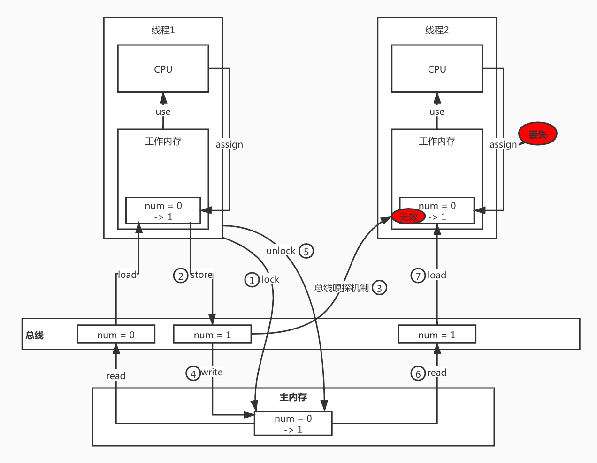

<!-- more -->

# Java 语言基础

## 数据类型

### 基本数据类型

Java 中的数值类型都是有符号的，取值范围是固定的，不会随着机器硬件环境或者操作系统的改变而改变。

#### 为什么需要基本数据类型

我们都知道在Java语言中，`new`一个对象是存储在堆里的，我们通过栈中的引用来使用这些对象；所以，对象是比较消耗资源的。

对于经常用到的类型，如 int 等，如果我们每次使用这种变量的时候都需要 new 一个对象的话，就会比较笨重。所以，和 C++ 一样，Java提供了基本数据类型，这种数据的变量不需要使用 new 创建，他们不会在堆上创建，而是直接存储在栈内存中，因此会更加高效。

#### 包装类型

Java 是一个面向对象的语言，但基本数据类型却不是面向对象的，这在实际使用时存在很多的不便，为了解决这个不足，在设计类时为每个基本数据类型设计了一个对应的类，这样八个和基本数据类型对应的类统称为包装类(Wrapper Class)。

##### 为什么需要包装类

Java 是一种面向对象语言，很多地方都需要使用对象而不是基本数据类型。比如，在集合类中，我们是无法将 int 、double 等类型放进去的。因为集合要求其元素是 Object 类型。

为了让基本类型也具有对象的特征，就出现了包装类型，它相当于将基本类型“包装起来”，使得它具有了对象的性质，并且为其添加了属性和方法，丰富了基本类型的操作。

##### 自动装箱/拆箱

###### 自动装箱与自动拆箱的实现原理

```java
public static  void main(String[]args){
    Integer integer=1; //装箱
    int i=integer; //拆箱
}
```

对以上代码进行反编译后可以得到以下代码：

```java
public static  void main(String[]args){
    Integer integer=Integer.valueOf(1); 
    int i=integer.intValue(); 
}
```

从上面反编译后的代码可以看出，int 的自动装箱都是通过`Integer.valueOf()`方法来实现的，Integer 的自动拆箱都是通过`integer.intValue()`来实现的。其他类型也有对应的方法。

> 自动装箱都是通过包装类的`valueOf()`方法来实现的，自动拆箱都是通过包装类对象的`xxxValue()`来实现的。

###### 容易被忽略的自动拆装箱场景

- Java 中的集合类只能接收对象类型，当我们把基本数据类型放入集合类中的时候，会进行自动装箱。

- 包装类与基本数据类型进行比较运算，是先将包装类拆箱成基本数据类型，然后进行比较的。

- 两个包装类型之间的运算，会自动拆箱成基本类型进行。

- 三目运算符的语法规范中定义，当第二、三位操作数分别为基本类型和对象时，其中的对象就会拆箱为基本类型进行操作。

  > [自动拆箱导致空指针异常](http://www.hollischuang.com/archives/435)
  >
  > ```java
  > Map<String,Boolean> map =  new HashMap<String, Boolean>();
  > Boolean b = (map!=null ? map.get("test") : false);
  > ```
  >
  > 上述代码运行后报 NPE：NullPointerException，查看反编译结果如下
  >
  > ```java
  > HashMap map = new HashMap();
  > Boolean b = Boolean.valueOf(map == null ? false : ((Boolean)map.get("test")).booleanValue());
  > ```
  >
  > hashmap.get(“test”)->null;
  >
  > (Boolean)null->null;
  >
  > null.booleanValue()->报错

- 函数参数与返回值

###### 自动装箱与缓存

在 Boxing Conversion 部分的 Java 语言规范(JLS)规定如下：

如果一个变量 p 的在以下范围内时：

- -128至127之间的整数(§3.10.1) 

- true 和 false的布尔值 (§3.10.3)

- ‘\u0000’至 ‘\u007f’之间的字符(§3.10.4)

将 p 包装成对象时，会直接使用缓存中的对象。

###### 自动拆装箱带来的问题

- 包装对象的数值比较，不能简单的使用`==`，虽然 -128 到 127 之间的数字可以，但是这个范围之外的还是需要使用`equals`比较。

- 由于自动拆箱，如果包装类对象为 null，那么自动拆箱后就有可能抛出NPE。

- 循环中有大量拆装箱操作，会浪费很多资源。

## 序列化与反序列化

序列化（Serialization）是将对象的状态信息转换为可以存储或传输的形式的过程。

反序列化（Unserialization）则是序列化的反过程。

在 Java 中，对象的序列化与反序列化被广泛应用到 RMI(远程方法调用)及网络传输中。

### 相关接口及类

> java.io.Serializable
> java.io.Externalizable
> java.io.ObjectOutputStream
> java.io.ObjectInputStream
> java.io.ObjectOutput
> java.io.ObjectInput

#### Serializable 接口

类通过实现 `java.io.Serializable` 接口来启用序列化功能。未实现此接口的类将无法使其任何状态序列化或反序列化。**可序列化类的所有子类型本身都是可序列化的**。此接口没有方法或字段，仅**用于标识**可序列化的语义。

如果没有实现 Serializable 接口，序列化时将抛出 `NotSerializableException`。

如果要将在父类中的变量持久化下来，那么父类也应该实现`java.io.Serializable`。

**序列化**

```java
ObjectInputStream ois = null;
try {
  ois = new ObjectInputStream(new FileInputStream(fileName));
  Test1 o = (Test1) ois.readObject();
  System.out.println(o);
} catch (IOException | ClassNotFoundException e) {
  e.printStackTrace();
}finally {
  try {
    assert ois != null;
    ois.close();
  } catch (IOException e) {
    e.printStackTrace();
  }
}
```

**反序列化**

```java
ObjectOutputStream oos = null;
try {
  oos = new ObjectOutputStream(new FileOutputStream(fileName));
  oos.writeObject(test1);
} catch (IOException e) {
  e.printStackTrace();
} finally {
  try {
    assert oos != null;
    oos.close();
  } catch (IOException e) {
    e.printStackTrace();
  }
}
```

#### Externalizable 接口

通过实现 Externalizable 接口的方式实现序列化时

- 如果类中没有空构造器，反序列化时则会报错 `java.io.InvalidClassException: xxx.xxx.xxx; no valid constructor`
- 如果没有实现接口的 `writeExternal()` 或 `readExternal()` 方法，则会将 fields 序列化/反序列化为默认值(int:0 Object:null)

#### Transient 关键字

在变量声明前加上该关键字，可以阻止该变量被序列化到文件中，在被反序列化后，transient 变量的值将被设为默认值，如 int 型的是 0，对象型的是 null。

#### 序列化ID

虚拟机是否允许反序列化，不仅取决于类路径和功能代码是否一致，还要确认两个类的序列化 ID 是否一致（`private static final long serialVersionUID`)

序列化 ID 有两种生成策略，一个是固定的 1L，一个是随机生成一个不重复的 long 类型数据（实际上是使用 JDK 工具生成）。

如果没有特殊需求，用默认的 1L 就可以，这样可以确保代码一致时反序列化成功。随机生成的序列化 ID 可以用来限制某些用户的使用。

### 序列化与单例模式

> [单例与序列化的那些事儿](https://cloud.tencent.com/developer/article/1341386)

#### 为什么序列化可以破坏单例模式？

序列化会通过反射调用无参构造器创建新对象，进而破坏单例模式。

`ObjectInputStream.readObject()` 的调用栈：

ObjectInputStream.readObject() ---> ObjectInputStream.readObject0() ---> ObjectInputStream.readOrdinaryObject() ---> ObjectInputStream.checkResolve()

```java
private Object readOrdinaryObject(boolean unshared) throws IOException {
  
  ...

  Object obj;
  try {
    // desc.isInstantiable() 是否实现了 Serializable/Externalizable 接口
    // desc.newInstance() 通过反射调用无参构造方法
    obj = desc.isInstantiable() ? desc.newInstance() : null;
  } catch (Exception ex) {
    throw (IOException) new InvalidClassException(
      desc.forClass().getName(),
      "unable to create instance").initCause(ex);
  }

  ...

    // desc.hasReadResolveMethod() 是否包含 readResolve() 方法
    if (obj != null &&
        handles.lookupException(passHandle) == null &&
        desc.hasReadResolveMethod())
    {
      // desc.invokeReadResolve(obj) 通过反射调用 readResolve() 方法。
      Object rep = desc.invokeReadResolve(obj);
      if (unshared && rep.getClass().isArray()) {
        rep = cloneArray(rep);
      }
      if (rep != obj) {
        // Filter the replacement object
        if (rep != null) {
          if (rep.getClass().isArray()) {
            filterCheck(rep.getClass(), Array.getLength(rep));
          } else {
            filterCheck(rep.getClass(), -1);
          }
        }
        handles.setObject(passHandle, obj = rep);
      }
    }

  return obj;
}
```

#### 如何防止序列化破坏单例模式

只要在类中定义 `readResolve()` 方法返回单例即可。

```java
package cn.gzhennaxia.test.io.serializable;

import java.io.Serializable;

public class Singleton implements Serializable {

  private volatile static Singleton singleton;

  private Singleton() {
  }

  /**
     * 使用双重校验锁实现单例模式
     *
     * @author bli@skystartrade.com
     * @date 2020-06-04 15:24
     */
  public static Singleton getInstance() {
    if (singleton == null) {
      synchronized (Singleton.class) {
        if (singleton == null) {
          singleton = new Singleton();
        }
      }
    }
    return singleton;
  }

  /**
     * 反序列化时会检查是否存在 readResolve() 方法，存在则调用它来实例化
     * 否则使用反射调用无参构造器实例化，因此可以通过创建 readResolve() 方法
     * 来保护单例在反序列化过程中不被破坏。
     *
     * @author bli@skystartrade.com
     * @date 2020-06-04 16:33
     */
  public Object readResolve() {
    return singleton;
  }
}
```

## JDK

### JDK 体系结构


### Command

#### javac

> [查看JAVA的class二进制文件的方法_u010325193的博客 ...](https://blog.csdn.net/u010325193/article/details/80792695)

将 .java 文件编译成字节码文件 .class

#### javap

将字节码文件反编译成 Java 文件

##### -c

反汇编为字节码指令

> [Java bytecode instruction listings - Wikipedia](https://en.wikipedia.org/wiki/Java_bytecode_instruction_listings)
>
> [jvm 指令手册- 掘金](https://juejin.im/post/5d2c453ce51d45775f516b11)

```java
javap -c Math.class > Math.txt
```

```java
Compiled from "Math.java"
public class Math {
  public static int initData;

  public static User user;

  public Math();
    Code:
       0: aload_0
       1: invokespecial #1                  // Method java/lang/Object."<init>":()V
       4: return

  public static void main(java.lang.String[]);
    Code:
       0: new           #2                  // class Math
       3: dup
       4: invokespecial #3                  // Method "<init>":()V
       7: astore_1
       8: aload_1
       9: invokevirtual #4                  // Method compute:()I
      12: pop
      13: getstatic     #5                  // Field java/lang/System.out:Ljava/io/PrintStream;
      16: ldc           #6                  // String test
      18: invokevirtual #7                  // Method java/io/PrintStream.println:(Ljava/lang/String;)V
      21: return

  public int compute();
    Code:
       0: iconst_1
       1: istore_1
       2: iconst_2
       3: istore_2
       4: iload_1
       5: iload_2
       6: iadd
       7: bipush        10
       9: imul
      10: istore_3
      11: iload_3
      12: ireturn

  static {};
    Code:
       0: sipush        666
       3: putstatic     #8                  // Field initData:I
       6: new           #9                  // class User
       9: dup
      10: invokespecial #10                 // Method User."<init>":()V
      13: putstatic     #11                 // Field user:LUser;
      16: return
}
```

## 本地方法

Java 中的 native 方法调用的是用 C 语言写的方法，存在系统的 xxx.dll 文件中，相当于 Java 中的 jar 包。

## JVM

完整的 JVM 包括类加载子系统、字节码执行引擎、运行时数据区(内存模型)。

### JVM 指令手册

> [Java bytecode instruction listings - Wikipedia](https://en.wikipedia.org/wiki/Java_bytecode_instruction_listings)
>
> [jvm 指令手册- 掘金](https://juejin.im/post/5d2c453ce51d45775f516b11)

### 内存模型


#### 程序计数器

记录当前线程执行到的代码指令的位置(行号/地址)。

**为什么要设计程序计数器？**

由于线程调度的原因，当当前线程的 CPU 时间片用完的时候，需要记录下当前运行的位置和状态，以便下一次再获得 CPU 时间片时继续执行。

### 常量池(元空间)

常量池中主要存放两类常量：字面量(Literal)和符号引用(Symbolic References)

#### Java 程序中发生异常时是如何知道哪行代码发生的异常

通过 `javap -v` 命令反编译 Java 文件可以看到，在常量池中有一个 `LineNumberTable` 其中记录了 jvm 指令与源代码行号的映射关系，当执行到某条指令发生异常时就可以知道是对应源代码的哪行代码。

#### Java 中的 this

从反编译文件中可以看出，在 `LocalVariableTable` 中第一个变量就是 this，所以 this 是编译时编译器隐士传递的局部变量。

注意：`javac` 默认不会生成调试信息(LocalVariableTable就是其中之一)，需要加上 `-g` 参数才可以。参考：[javap -v没有显示LocalVaribleTable](https://blog.csdn.net/weixin_30481087/article/details/97001857)

### 堆

#### 分代年龄

分代年龄存储于对象头中。年轻代中的对象在每次 `minor gc` 后存活下来的对象的分代年龄会加一，当分代年龄超过阀值(默认为15)时会被存放到老年代中。

有两个参数：

- `-XX:MaxTenuringThreshold`，晋升年龄最大阈值，默认15，新生代中经过数次 YGC 后，对象仍然存活并且达到了晋升年龄阈值，该对象就会晋升到老年代中。
- `-XX:TargetSurvivorRatio`，设置 Suvivor 区的目标使用率，默认 50，表示 Survivor 区对象目标使用率为 50%。

#### 对象动态年龄判断

Survivor 区的对象年龄从小到大进行累加，当累加到 X 年龄时的总和大于50%**（可以使用-XX:TargetSurvivorRatio=? 来设置保留多少空闲空间，默认值是50）**，那么比X大的都会晋升到老年代。

### 垃圾回收机制

#### 垃圾检测算法

##### 可达性分析算法

以 `GC Roots` 对象为起点，向下搜索引用的对象，将找到的对象都标记为**非垃圾对象**，其余的对象均为**垃圾对象**。

GC Roots：线程栈的本地变量、静态变量、本地方法的变量等等。

#### 垃圾回收算法

### VisualVM

VisualVM 是一种工具，它提供了可视化界面，用于查看 Java 虚拟机上运行的 Java 应用程序的详细信息。

> [使用jvisualvm监控Java程序（本地和远程） - 掘金](https://juejin.im/post/5a3b92def265da4319567218)
>
> [使用 VisualVM 进行性能分析及调优](https://www.ibm.com/developerworks/cn/java/j-lo-visualvm/)
>
> [Java程序内存分析Java VisualVM（Visual GC）-点滴积累 ...](https://blog.51cto.com/tianxingzhe/1651384)

#### 本地启动

直接在终端敲命令`jvisualvm`就可以运行，然后可以看到运行界面。

#### STW(stop the world)

> [(干货篇) JVM stop the world - 掘金](https://juejin.im/post/5dc910586fb9a04a95289f28)

等待所有用户线程进入安全点后并阻塞，做一些全局性操作(例如 GC)的行为。

### 垃圾回收算法

大对象直接进入老年代

### JVM 调优

调优的目的/目标：减少 GC 次数，加快 GC 运行速度。

## 线程

### JVM 线程和操作系统线程

Java 的线程和操作系统的线程是一一对应的。使用 Java 线程就是使用一个操作系统本地线程。

在 Java1.1 的时候，Solaris 系统上的 JVM，其线程和操作系统线程并不是一一对应的，称之为  绿色线程 。

所谓绿色线程，即该线程是虚拟机层面上的线程，由虚拟机创建，调度和销毁，操作系统对这种线程一无所知。由于绿色线程实现复杂，并且相当于 OS 的原生线程又有着诸多限制，所以 Java 后续的版本就放弃采用这种方式。

# 规范

## 成员变量和接口的返回值类型及命名

布尔类型的成员变量有如下四种定义方式

```java
boolean success
boolean isSuccess
Boolean success
Boolean isSuccess
```

### success/isSuccess

在阿里巴巴Java开发手册中关于这一点，有过一个『强制性』规定：

> 8.【强制】POJO类中的任何布尔类型的变量，都不要加is前缀，否则部分框架解析会引起序列化错误。
>
> 说明：在本文MySQL规约中的建表约定第一条，表达是与否的值采用is_xxx的命名方式，所以，需要在<resultMap>设置从is_xxx到xxx的映射关系。
>
> 反例：定义为基本数据类型Boolean isDeleted的属性，它的方法也是isDeleted()，框架在反向解析的时候，“误以为”对应的属性名称是deleted，导致属性获取不到，进而抛出异常。

#### Java Bean中关于setter/getter的规范

> 8.3.2 Boolean properties
>
> In addition, for boolean properties, we allow a getter method to match the pattern:
>
> `public boolean is<PropertyName>();`
>
> This “is<PropertyName>” method may be provided instead of a “get<PropertyName>” meth-od, or it may be provided in addition to a “get<PropertyName>” method.
>
> In either case, if the “is<PropertyName>” method is present for a boolean property then we will use the “is<PropertyName>” method to read the property value.
>
> An example boolean property might be:
>
> ```java
> public boolean isMarsupial();
> public void setMarsupial(boolean m);
> ```

关于Java Bean中的getter/setter方法的定义其实是有明确的规定的，根据[JavaBeans(TM) Specification](https://download.oracle.com/otndocs/jcp/7224-javabeans-1.01-fr-spec-oth-JSpec/)规定，如果是普通的参数propertyName，要以以下方式定义其setter/getter：

```java
public <PropertyType> get<PropertyName>();
public void set<PropertyName>(<PropertyType> a);
```

但是，布尔类型的变量propertyName则是单独定义的：

```java
public boolean is<PropertyName>();
public void set<PropertyName>(boolean m);
```

#### 序列化带来的影响

比较常用的 fastJson、jackson 和 Gson 之间有何区别：

```java
public class Test implements Serializable {

    private boolean isSuccess;

    public boolean isSuccess() {
        return isSuccess;
    }

    public void setSuccess(boolean success) {
        isSuccess = success;
    }

    public String getBoris() {
        return "Boris";
    }
  
    @Override
    public String toString() {
        return "Test{" +
                "isSuccess=" + isSuccess +
                '}';
    }
}
```

```java
public class JsonTest {

    public static void main(String[] args) throws JsonProcessingException {
        Test test = new Test();
        test.setSuccess(true);

        System.out.println("Serializable Result With fastjson-1.2.58 :" + JSON.toJSONString(test));

        System.out.println("Serializable Result With Gson-2.8.5 :" + new Gson().toJson(test));

        System.out.println("Serializable Result With jackson-2.10.0 :" + new ObjectMapper().writeValueAsString(test));
    }
}
```

以上代码输出结果：

```
Serializable Result With fastjson-1.2.58 :{"boris":"Boris","success":true}
Serializable Result With Gson-2.8.5 :{"isSuccess":true}
Serializable Result With jackson-2.10.0 :{"success":true,"boris":"Boris"}
```

在 fastjson 和 jackson 的结果中，原来类中的 isSuccess 字段被序列化成 success，并且其中还包含 boris 值。而 Gson 中只有 isSuccess 字段。

由此可以得出**结论**：

fastjson 和 jackson 在把对象序列化成 json 字符串的时候，是通过反射遍历出该类中的所有 getter 方法，得到 getBoris 和 isSuccess，然后根据 JavaBeans 规范，会认为这是属性 boris 和 success 的值。直接序列化成 `{"hollis":"hollischuang","success":true}`

Gson 是通过反射遍历该类中的所有属性，然后进行序列化操作 `{"isSuccess":true}`

可以看到，由于不同的序列化工具，在进行序列化的时候使用到的策略是不一样的，所以，对于同一个类的同一个对象的序列化结果可能是不同的。

如果使用 fastjson 进行序列化，再使用 Gson 反序列化就会出现与实际相反的结果。

```java
// 去掉 Test 的 getBoris() 方法运行下面的代码
System.out.println(gson.fromJson(JSON.toJSONString(test), Test.class));

// Result:
// Test{isSuccess=false}
```

生产环境出现这种现象，则是一个致命的问题。

所以，作为开发者，应该避免这种问题的发生，把 isSuccess 改为 success，这样，成员变量是 success，getter 方法是 isSuccess，完全符合 JavaBeans 规范。无论哪种序列化框架，执行结果都一样。

> R 大关于阿里巴巴 Java 开发手册这条规定的评价（https://www.zhihu.com/question/55642203）：
>
> 

### Boolean/boolean

> 12.关于基本数据类型与包装数据类型的使用标准如下：
>
> 1）【强制】所有的POJO类属性必须使用包装数据类型。
>
> 2）【强制】RPC方法的返回值和参数必须使用包装数据类型。
>
> 3）【推荐】所有的局部变量使用基本数据类型。
>
> 说明：POJO类属性没有初值是提醒使用者在需要使用时，必须自己显式地进行赋值，任何NPE问题，或者入库检查，都由使用者来保证。
>
> 正例：数据库的查询结果可能是null，因为自动拆箱，用基本数据类型接收有NPE风险。
>
> 反例：某业务的交易报表上显示成交总额涨跌情况，即正负x%，x为基本数据类型，调用的RPC服务，调用不成功时，返回的是默认值，页面显示为0%，这是不合理的，应该显示成中划线-。所以包装数据类型的null值，能够表示额外的信息，如：远程调用失败，异常退出。

使用包装类型定义变量的方式，通过异常来阻断程序，进而可以被识别到这种线上问题。如果使用基本数据类型的话，系统可能不会报错，进而认为无异常。

# JMM

Java Memory Model java内存模型

## 多核并发缓存架构


Java 线程内存模型与 CPU 缓存模型类似，是基于 CPU 缓存模型来建立的，Java 线程内存模型是标准化的，屏蔽掉了底层不同计算机的区别。


```java
public class VolatileVisibilityTest {

    private static boolean initFlag = false;

    public static void main(String[] args) throws InterruptedException {
        new Thread(new Runnable() {
            @Override
            public void run() {
                System.out.println("waiting data...");
                while (!initFlag) {
                }
                System.out.println("=====================success");
            }
        }).start();

        Thread.sleep(2000);

        new Thread(new Runnable() {
            @Override
            public void run() {
                prepareData();
            }
        }).start();
    }

    public static void prepareData() {
        System.out.println("preparing data...");
        initFlag = true;
        System.out.println("prepare data end...");
    }
}
```

上述代码运行结果：

```
waiting data...
preparing data...
prepare data end...

____________________
死循环，程序无法正常结束
```

使用 `volatile` 修饰变量 `initFlag` 后运行结果：

```
waiting data...
preparing data...
prepare data end...
=====================success

____________________
正常结束
```

## 原子操作

1. read（读取）：从主内存读取数据
2. load（载入）：将主内存读取到的数据写入工作内存
3. use（使用）：从工作内存读取数据来计算
4. assign（赋值）：将计算好的值重新赋值到工作内存中
5. store（存储）：将工作内存数据写入主内存
6. write（写入）：将store过去的变量赋值给主内存中的变量
7. lock（锁定）：将主内存变量加锁，标识为线程独占状态
8. unlock（解锁）：将内存变量解锁，解锁后其他线程可以锁定该变量

## 总线加锁

CPU 从主内存读取数据到高速缓存，会在总线对这个数据加锁，其他 CPU 将无法读取或写入这个数据，直到这个 CPU 使用完数据并释放锁只有，其他 CPU 才能读取。

## MESI 缓存一致性协议

多个 CPU 从主内存读取同一个数据到各自的高速缓存，当其中某个 CPU 修改了缓存里的数据，该数据会马上同步回主内存，其他 CPU 通过**总线嗅探机制**可以感知到数据的变化，从而将自己缓存里的数据失效。

## Volatile 缓存可见性实现原理

底层实现主要是通过汇编 lock 前缀指令，它会锁定这块内存区域的缓存(缓存行锁定)，并回写到主内存。

IA-32 架构软件开发者手册对 lock 指令的解释：

1. 会将当前处理器缓存行的数据立即写回到系统内存。
2. 这个写回内存的操作会引起其他 CPU 里缓存了该内存地址的数据无效(MESI协议)

### 测试案例

#### 案例一

#### 案例二

```java
public class VolatileVisibilityTest2 {

    private static volatile int num = 0;

    public static void main(String[] args) throws InterruptedException {

        Thread[] threads = new Thread[10];
        for (int i = 0; i < 10; i++) {
            threads[i] = new Thread(new Runnable() {
                @Override
                public void run() {
                    for (int j = 0; j < 1000; j++) {
                        increase();
                    }
                }
            });
        }

        for (Thread thread : threads) {
            thread.start();
        }

        for (Thread thread : threads) {
            thread.join();
        }

        System.out.println(num);
    }

    public static void increase() {
        num++;
    }
}
```

运行结果：多次运行，结果都是小于等于 10000 的一个值。

解释：

当多个线程同时执行 assign，因为加了 volatile 此时这些线程会立即向主内存同步数据，但只会有一个线程成功执行 lock 操作，然后继续执行 store 操作，在进行 store 操作时，由于总线嗅探机制的存在，其他线程就会感知到，进而将其数据的状态置为失效状态，也就丢失了其之前的数据操作。故案例二中的 num 最终的结果是 <= 20000。




## Java 程序汇编代码查看

> [学会一个JVM插件：使用HSDIS反汇编JIT生成的代码- 云+社区 ...](https://cloud.tencent.com/developer/article/1082675)

1. 下载 `hsdis-amd64.dylib` 插件，放到 jdk 的 jre/bin 目录下
2. IDEA 中配置 VM Options，并修改 jre 为上面包含了 `hsdis-amd64.dylib` 的。
3. 然后运行程序即可在控制台中看到相应汇编代码。

Edit Configuration > VM Options:

```
-server -Xcomp -XX:+UnlockDiagnosticVMOptions -XX:+PrintAssembly -XX:CompileCommand=compileonly,*VolatileVisibilityTest.prepareData
```

## 字节码文件

字节码文件中有两个字节表示实现的接口的个数，因此 **Java 类可实现的接口最大个数**为 65535。

## 类加载器

### 分类

#### 系统级别

- 启动类加载器
- 扩展类加载器

###  命名空间


# String

## substring

> [JDK 6和JDK 7中 substring 的原理及区别](http://hollischuang.gitee.io/tobetopjavaer/#/basics/java-basic/substring?id=jdk-6和jdk-7中substring的原理及区别)

### JDK 6 中的 substring

String 是通过字符数组实现的。在 jdk 6 中，String 类包含三个成员变量：`char value[]`， `int offset`，`int count`。他们分别用来存储真正的字符数组，数组的第一个位置索引以及字符串中包含的字符个数。

当调用 substring 方法的时候，会创建一个新的 string 对象，但是这个 string 的 value 值仍然指向堆中的**同一个字符数组**。这两个对象中只有 count 和 offset 的值是不同的。

```java
//JDK 6
String(int offset, int count, char value[]) {
    this.value = value;
    this.offset = offset;
    this.count = count;
}

public String substring(int beginIndex, int endIndex) {
    //check boundary
    return  new String(offset + beginIndex, endIndex - beginIndex, value);
}
```

#### JDK 6 中的 substring 导致的问题

如果你有一个很长很长的字符串，但是当你使用 substring 进行切割的时候你只需要很短的一段。这可能导致性能问题，因为你需要的只是一小段字符序列，但是你却引用了整个字符串（因为这个非常长的字符数组一直在被引用，所以无法被回收，就可能导致内存泄露）。一般用以下方式来解决该问题，原理其实就是生成一个新的字符串并引用他。

```java
x = x.substring(x, y) + ""
```

关于 JDK 6 中 subString 的使用不当会导致内存泄漏已经被官方记录在 Java Bug Database 中：


> 内存泄露：在计算机科学中，内存泄漏指由于疏忽或错误造成程序未能释放已经不再使用的内存。内存泄漏并非指内存在物理上的消失，而是应用程序分配某段内存后，由于设计错误，导致在释放该段内存之前就失去了对该段内存的控制，从而造成了内存的浪费。

### JDK 7 中的substring

在 jdk 7 中，substring 方法会在堆内存中创建一个新的数组。


```java
//JDK 7
public String(char value[], int offset, int count) {
    //check boundary
    this.value = Arrays.copyOfRange(value, offset, offset + count);
}

public String substring(int beginIndex, int endIndex) {
    //check boundary
    int subLen = endIndex - beginIndex;
    return new String(value, beginIndex, subLen);
}
```

JDK 7 中的 subString 方法，使用`Arrays.copyOfRange()`将旧字符串的字符数组中的字符选择性的 copy 到新字符串的字符数组中，避免对老字符串字符数组的引用。从而解决了内存泄露问题。

## replace

### replaceFirst、replaceAll、replace 的区别

- replaceAll 以及 replaceFirst 是和正则表达式有关的，而 replace 和正则表达式无关。

- replaceAll 替换所有匹配的字符，而 replaceFirst 仅替换第一次出现的字符

